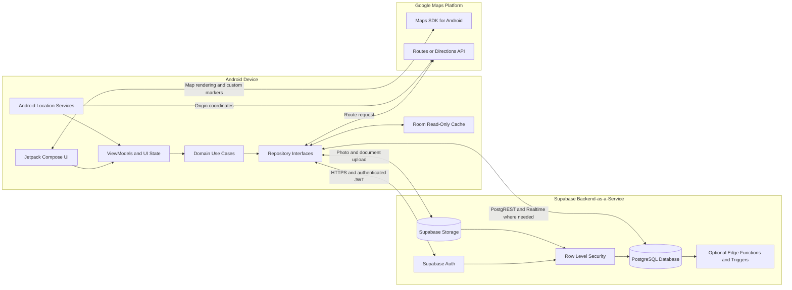
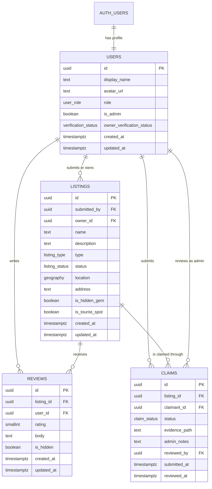
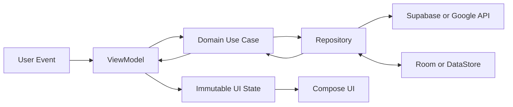

# Kapwa DVO - System Architecture

## 1. System Overview

**Kapwa DVO** is a native Android discovery platform for local experiences, public spaces, tourist attractions, hidden gems, and small-to-medium businesses within Davao City. It digitizes and expands the idea of a Davao Tourist Passport by allowing visitors and local residents to discover places on an interactive map, contribute reviews and photos, propose public spaces, and navigate to selected destinations.

The system uses a deliberately simple **client-plus-Backend-as-a-Service architecture** suitable for an MVP and school project:

- The Android application provides the user interface, device location, offline read-only cache, and map experience.
- Supabase provides authentication, PostgreSQL data storage, Row Level Security, and media storage.
- Google Maps Platform provides map rendering and route calculation.
- Administrative and business operations use the same Android application, with features enabled according to the authenticated user's server-verified role.

### Core architectural principles

- **Server-enforced authorization:** Client-side checks improve the user experience, but PostgreSQL Row Level Security is the final authorization boundary.
- **Single source of truth:** Supabase PostgreSQL is authoritative for profiles, listings, reviews, claims, approvals, and ownership.
- **Unidirectional data flow:** Compose screens render immutable UI state and emit user actions to ViewModels.
- **Offline-first reads, online-only writes:** Cached listings remain viewable without a network connection; submissions, uploads, claims, reviews, and routing require connectivity.
- **MVP-focused design:** Supabase is used directly as the backend rather than introducing custom microservices.

### Primary user journey

1. A guest or registered user discovers a listing on the map.
2. A registered user reviews a place, saves it, or proposes a public space.
3. Community interest helps identify promising submissions for review.
4. An administrator verifies, rejects, hides, or tags the listing.
5. A verified business owner submits a claim with supporting documents.
6. An administrator approves the claim, after which the owner can manage the listing in Business Mode.

---

## 2. High-Level System Architecture



### Component responsibilities

| Component | Responsibility |
|---|---|
| Android app | Presentation, navigation, location permission handling, map interaction, form validation, and local caching. |
| Supabase Auth | Email/password and Google authentication, session management, and JWT issuance. |
| PostgreSQL | Authoritative application data and relational integrity. |
| Row Level Security | Per-row authorization based on identity, role, ownership, and record status. |
| Supabase Storage | Listing photos, review photos, government ID evidence, and ownership documents. |
| Google Maps Platform | Interactive maps, custom pins, current-location display, and point-to-point routing. |
| Room | Last-known listing data and saved-place details for read-only offline access. |

> Authentication establishes identity; it does not by itself grant administrative privileges. Every privileged database or storage operation must also pass server-side authorization.

---

## 3. Tech Stack and Tooling

### Android frontend

- **Kotlin:** Primary implementation language.
- **Jetpack Compose:** Declarative UI for maps, discovery, authentication, listing details, reviews, and mode-aware navigation.
- **Material 3:** Design system, accessibility-aware components, typography, and theming.
- **Navigation Compose:** Type-safe or strongly structured screen navigation with role-gated destinations.
- **ViewModel and Kotlin Coroutines:** Lifecycle-aware state management and asynchronous work.
- **StateFlow:** Observable, immutable UI state and one-way event flow.
- **Hilt:** Dependency injection for repositories, use cases, API clients, database access objects, and dispatchers.
- **Supabase Kotlin client:** Authentication, PostgREST database access, and Storage integration.
- **Google Maps Compose:** Map rendering, markers, camera state, and user interaction.
- **Google Play Services Location:** Fused location provider for current-location updates.
- **Room:** Structured local cache for listings and selected metadata.
- **DataStore Preferences:** Small settings such as selected app mode, theme, onboarding state, and cache metadata.
- **Coil:** Remote image loading and memory/disk image caching.
- **WorkManager:** Optional constrained refresh of cached listing data; not required for offline write synchronization.

### Backend and data platform

- **Supabase Auth:** Email/password and Google sign-in.
- **Supabase PostgreSQL:** Relational application database.
- **PostGIS:** Recommended for geographical coordinates, radius searches, and proximity ordering.
- **Supabase Row Level Security:** Database-enforced access control.
- **Supabase Storage:** Public listing media and private verification documents in separate buckets.
- **PostgreSQL functions and triggers:** Small, security-sensitive workflows such as claim approval, timestamps, moderation flags, and derived vote counts.
- **Supabase Edge Functions:** Optional for operations that require protected server secrets or coordinated privileged transactions. They are not a replacement for RLS.

### External services

- **Google Maps SDK for Android:** Base map and custom markers.
- **Google Routes API or Directions API:** Fastest-route calculation from the user's current location to a listing.
- **Google Cloud API key restrictions:** Restrict the Android Maps key by package name and SHA certificate fingerprint. Route requests that require a server secret should be proxied through a Supabase Edge Function.

### Development and quality tooling

- **Android Studio and Gradle Version Catalogs:** Development environment and centralized dependency versions.
- **GitHub:** Source control, pull requests, issue tracking, and project milestones.
- **GitHub Actions:** Build, lint, and test validation on pull requests.
- **JUnit:** Unit tests for use cases, reducers, validators, and ViewModels.
- **MockK or test fakes:** Repository and service test doubles.
- **Compose UI Test:** Login, role switching, discovery, and moderation flow tests.
- **Turbine:** Testing `Flow` and `StateFlow` emissions.
- **Detekt and ktlint:** Static analysis and consistent Kotlin formatting.
- **Figma and Dev Mode:** Wireframes, reusable components, design tokens, and developer handoff.

### Suggested Git workflow

- Keep `main` deployable and protected.
- Use short-lived branches such as `feature/map-integration`, `feature/business-claims`, and `bugfix/admin-login`.
- Require pull-request review and successful automated checks before merging.
- Track the MVP as GitHub milestones and issues rather than maintaining multiple deployment services.

---

## 4. Database Schema - Supabase/PostgreSQL

Supabase Auth owns the `auth.users` table. The application's public `users` table is a profile and authorization extension keyed by the same UUID. The following schema covers the four required core tables while leaving room for favorites, listing requests, and media records as focused MVP extensions.

### Entity-relationship diagram



### PostgreSQL schema

```sql
-- Enable geographical queries for nearby-place discovery.
create extension if not exists postgis;

create type public.user_role as enum (
  'registered',
  'business_owner',
  'admin'
);

create type public.verification_status as enum (
  'not_submitted',
  'pending',
  'approved',
  'rejected'
);

create type public.listing_type as enum (
  'business',
  'public_space',
  'tourist_spot'
);

create type public.listing_status as enum (
  'pending',
  'verified',
  'rejected',
  'hidden'
);

create type public.claim_status as enum (
  'pending',
  'approved',
  'rejected',
  'cancelled'
);

create table public.users (
  id uuid primary key references auth.users(id) on delete cascade,
  display_name text not null check (char_length(display_name) between 2 and 80),
  avatar_url text,
  role public.user_role not null default 'registered',
  is_admin boolean not null default false,
  owner_verification_status public.verification_status not null default 'not_submitted',
  created_at timestamptz not null default now(),
  updated_at timestamptz not null default now(),

  constraint admin_role_consistency check (
    (is_admin = true and role = 'admin') or
    (is_admin = false and role <> 'admin')
  ),
  constraint approved_owner_consistency check (
    role <> 'business_owner' or owner_verification_status = 'approved'
  )
);

create table public.listings (
  id uuid primary key default gen_random_uuid(),
  submitted_by uuid not null references public.users(id) on delete restrict,
  owner_id uuid references public.users(id) on delete set null,
  name text not null check (char_length(name) between 2 and 120),
  description text not null default '',
  type public.listing_type not null,
  status public.listing_status not null default 'pending',
  location geography(point, 4326) not null,
  address text not null,
  primary_photo_path text,
  is_hidden_gem boolean not null default false,
  is_tourist_spot boolean not null default false,
  community_request_count integer not null default 0 check (community_request_count >= 0),
  created_at timestamptz not null default now(),
  updated_at timestamptz not null default now()
);

create table public.reviews (
  id uuid primary key default gen_random_uuid(),
  listing_id uuid not null references public.listings(id) on delete cascade,
  user_id uuid not null references public.users(id) on delete cascade,
  rating smallint not null check (rating between 1 and 5),
  body text not null default '' check (char_length(body) <= 2000),
  is_hidden boolean not null default false,
  created_at timestamptz not null default now(),
  updated_at timestamptz not null default now(),

  constraint one_review_per_user_per_listing unique (listing_id, user_id)
);

create table public.claims (
  id uuid primary key default gen_random_uuid(),
  listing_id uuid not null references public.listings(id) on delete cascade,
  claimant_id uuid not null references public.users(id) on delete cascade,
  status public.claim_status not null default 'pending',
  evidence_path text not null,
  admin_notes text,
  reviewed_by uuid references public.users(id) on delete set null,
  submitted_at timestamptz not null default now(),
  reviewed_at timestamptz,

  constraint reviewed_claim_has_reviewer check (
    (status = 'pending' and reviewed_by is null and reviewed_at is null) or
    (status <> 'pending')
  )
);

-- Allow only one active claim by a claimant for the same listing.
create unique index claims_one_pending_per_claimant_listing
  on public.claims (listing_id, claimant_id)
  where status = 'pending';

create index listings_status_idx on public.listings (status);
create index listings_owner_idx on public.listings (owner_id);
create index listings_location_gix on public.listings using gist (location);
create index reviews_listing_idx on public.reviews (listing_id);
create index claims_listing_status_idx on public.claims (listing_id, status);
```

### Schema notes

- **Guest is not stored as a database role.** A guest is an unauthenticated request with no Supabase user identity.
- **`role` and `is_admin` are server-managed.** Clients must never be allowed to promote themselves by updating either field.
- **Coordinates use PostGIS geography.** This supports indexed radius queries and distance ordering. The Android app can map the point to latitude and longitude.
- **Claim evidence stores a path, not a public URL.** Government ID and ownership files belong in a private Storage bucket and should be exposed only through short-lived signed URLs to the claimant and administrators.
- **Claim approval should be transactional.** A security-definer database function may approve the claim, assign `listings.owner_id`, and promote an approved claimant to `business_owner` in one transaction after checking that the caller is an administrator.
- **Community requests should use a separate join table** such as `listing_requests(listing_id, user_id, created_at)` with a unique pair. The count should be derived by a view or maintained by a trigger rather than directly writable by clients.
- **Photos should use a separate media table** if multiple listing and review photos are required. Storage object paths should be persisted rather than embedding image data in PostgreSQL.

### Recommended supporting tables

| Table | Purpose |
|---|---|
| `favorites` | Unique mapping between a user and a saved listing. |
| `listing_requests` | One community request or upvote per user and proposed listing. |
| `listing_media` | Listing gallery metadata and Storage object paths. |
| `review_media` | Photo metadata associated with a review. |
| `moderation_reports` | User reports and administrator resolution state. |
| `audit_log` | Append-only record of sensitive administrative actions. |

---

## 5. Security and Role-Based Access Control

### Security model

Kapwa DVO uses **defense in depth**:

1. The Android UI hides actions and destinations that the active user cannot use.
2. ViewModels and use cases reject invalid local actions early.
3. Supabase Auth verifies the user's identity and issues a JWT.
4. PostgreSQL RLS authorizes every row-level operation.
5. Storage policies authorize every uploaded or downloaded object.
6. Constraints and privileged database functions preserve invariants during administrative workflows.

The Android client is not a trusted security boundary. A modified application or direct HTTP request must still be unable to bypass RLS.

### Role capability matrix

| Capability | Guest | Registered | Business Owner | Admin |
|---|---:|---:|---:|---:|
| Read verified listings | Yes | Yes | Yes | Yes |
| Search, filter, and view map pins | Yes | Yes | Yes | Yes |
| Create or edit own review | No | Yes | Yes | Yes |
| Save favorites and upload review photos | No | Yes | Yes | Yes |
| Propose a public space | No | Yes | Yes | Yes |
| Submit a business claim | No | Yes | Yes | Yes |
| Manage an owned listing | No | No | Yes | Yes |
| View private claim documents | No | Own only | Own only | Yes |
| Approve claims or listings | No | No | No | Yes |
| Hide listings or reviews | No | No | No | Yes |
| Assign administrative tags | No | No | No | Yes |

### RLS helper function

A helper keeps policies readable. It must use a protected search path, and ordinary users must not have permission to alter the function or authorization columns.

```sql
create or replace function public.is_admin()
returns boolean
language sql
stable
security definer
set search_path = public
as $$
  select exists (
    select 1
    from public.users
    where id = auth.uid()
      and role = 'admin'
      and is_admin = true
  );
$$;

revoke all on function public.is_admin() from public;
grant execute on function public.is_admin() to authenticated;
```

### Representative RLS policies

```sql
alter table public.users enable row level security;
alter table public.listings enable row level security;
alter table public.reviews enable row level security;
alter table public.claims enable row level security;

-- Profiles: authenticated users may read profiles needed by the community UI.
create policy "authenticated users read profiles"
on public.users for select
to authenticated
using (true);

-- A user may update safe fields in their own profile, but column-level
-- grants or an RPC must prevent changes to role, is_admin, and verification status.
create policy "users update own profile"
on public.users for update
to authenticated
using (id = auth.uid())
with check (id = auth.uid());

-- Public map data includes verified listings only.
create policy "public reads verified listings"
on public.listings for select
to anon, authenticated
using (status = 'verified');

-- Submitters can also inspect their own pending proposal; owners can inspect
-- their own listing; administrators can inspect all moderation states.
create policy "members read relevant nonpublic listings"
on public.listings for select
to authenticated
using (
  submitted_by = auth.uid()
  or owner_id = auth.uid()
  or public.is_admin()
);

create policy "members propose listings"
on public.listings for insert
to authenticated
with check (
  submitted_by = auth.uid()
  and owner_id is null
  and status = 'pending'
  and is_hidden_gem = false
  and is_tourist_spot = false
);

create policy "approved owners update owned listings"
on public.listings for update
to authenticated
using (
  owner_id = auth.uid()
  and exists (
    select 1 from public.users
    where id = auth.uid()
      and role = 'business_owner'
      and owner_verification_status = 'approved'
  )
)
with check (owner_id = auth.uid());

-- Use column grants or a restricted RPC so an owner cannot change status,
-- owner_id, moderation tags, or submitted_by through an otherwise valid update.

create policy "admins manage all listings"
on public.listings for all
to authenticated
using (public.is_admin())
with check (public.is_admin());

create policy "public reads visible reviews of verified listings"
on public.reviews for select
to anon, authenticated
using (
  is_hidden = false
  and exists (
    select 1 from public.listings
    where listings.id = reviews.listing_id
      and listings.status = 'verified'
  )
);

create policy "members create own reviews"
on public.reviews for insert
to authenticated
with check (
  user_id = auth.uid()
  and is_hidden = false
  and exists (
    select 1 from public.listings
    where listings.id = reviews.listing_id
      and listings.status = 'verified'
  )
);

create policy "members update own visible reviews"
on public.reviews for update
to authenticated
using (user_id = auth.uid())
with check (user_id = auth.uid() and is_hidden = false);

create policy "members delete own reviews"
on public.reviews for delete
to authenticated
using (user_id = auth.uid() or public.is_admin());

create policy "claimants read own claims and admins read all"
on public.claims for select
to authenticated
using (claimant_id = auth.uid() or public.is_admin());

create policy "members submit their own claims"
on public.claims for insert
to authenticated
with check (
  claimant_id = auth.uid()
  and status = 'pending'
  and reviewed_by is null
  and reviewed_at is null
);

create policy "admins review claims"
on public.claims for update
to authenticated
using (public.is_admin())
with check (public.is_admin());
```

### Protecting authorization columns

A row-level update policy alone does not prevent a user from changing sensitive columns in their own row. Use one of these approaches:

- Revoke broad table updates and grant authenticated users access only to safe profile columns such as `display_name` and `avatar_url`.
- Prefer a narrow RPC such as `update_my_profile(new_display_name, new_avatar_url)`.
- Reserve `role`, `is_admin`, and `owner_verification_status` changes for administrative functions executed after an RLS-protected authorization check.

The mobile app must use only the Supabase **publishable/anon key**. The Supabase service-role key bypasses RLS and must never be bundled in the APK, committed to Git, or used directly by the Android client.

### Strict administrator login

The administrator login screen performs the required case-sensitive client-side validation before calling Supabase:

```kotlin
private val AdminEmailRegex = Regex("^[A-Za-z0-9.!#$%&'*+/=?^_`{|}~-]+@kapwadvo\\.com$")

fun isValidAdminEmail(email: String): Boolean =
    email == email.trim() && AdminEmailRegex.matches(email)
```

This accepts the domain only when it is exactly `@kapwadvo.com`; uppercase variants such as `@KAPWADVO.COM` are rejected. The app must not lowercase the address before this check.

Client validation is only a UX and request-filtering measure. After authentication:

1. Supabase verifies the email and password.
2. The app retrieves the user's profile.
3. Admin navigation is enabled only when `role = 'admin'`, `is_admin = true`, and the authenticated email ends with the exact case-sensitive domain.
4. RLS independently checks the database-backed admin flag for every privileged operation.
5. Admin accounts are provisioned manually by a trusted database administrator; signing up with a matching domain must never self-assign the admin role.

For stronger production security, admin accounts should also require email verification and multi-factor authentication. For the school MVP, manually provisioned accounts, strong passwords, RLS, and audit logging are sufficient.

### Storage policies

Use separate buckets with different exposure levels:

| Bucket | Access model |
|---|---|
| `listing-media` | Public read for approved listing images; authenticated users upload only to permitted paths. |
| `review-media` | Public read for visible review images; users manage only objects under their own user ID. |
| `claim-evidence` | Private; claimant and administrators only, using short-lived signed URLs. |
| `owner-verification` | Private; submitting user and administrators only. |

Object keys should be namespaced, for example `claims/{auth.uid()}/{claimId}/{fileName}`. Storage policies must validate the first path segment against `auth.uid()` and must not rely on a filename supplied by the client for authorization.

---

## 6. Android App Architecture - MVVM and Clean Architecture

Kapwa DVO uses a pragmatic single-app module with package-level Clean Architecture boundaries. Additional Gradle modules can be introduced later, but they are unnecessary for the MVP.

```text
app/
├── src/main/java/com/kapwadvo/
│   ├── KapwaDvoApplication.kt
│   ├── MainActivity.kt
│   │
│   ├── di/
│   │   ├── AppModule.kt
│   │   ├── DatabaseModule.kt
│   │   ├── NetworkModule.kt
│   │   ├── RepositoryModule.kt
│   │   └── DispatcherModule.kt
│   │
│   ├── domain/
│   │   ├── model/
│   │   │   ├── User.kt
│   │   │   ├── Listing.kt
│   │   │   ├── Review.kt
│   │   │   ├── Claim.kt
│   │   │   ├── AppRole.kt
│   │   │   └── AppMode.kt
│   │   ├── repository/
│   │   │   ├── AuthRepository.kt
│   │   │   ├── ListingRepository.kt
│   │   │   ├── ReviewRepository.kt
│   │   │   ├── ClaimRepository.kt
│   │   │   └── RouteRepository.kt
│   │   └── usecase/
│   │       ├── auth/
│   │       ├── discovery/
│   │       ├── listing/
│   │       ├── review/
│   │       ├── claim/
│   │       └── admin/
│   │
│   ├── data/
│   │   ├── remote/
│   │   │   ├── supabase/
│   │   │   │   ├── SupabaseProvider.kt
│   │   │   │   ├── AuthRemoteDataSource.kt
│   │   │   │   ├── ListingRemoteDataSource.kt
│   │   │   │   ├── ReviewRemoteDataSource.kt
│   │   │   │   ├── ClaimRemoteDataSource.kt
│   │   │   │   └── StorageRemoteDataSource.kt
│   │   │   ├── maps/
│   │   │   │   ├── RouteRemoteDataSource.kt
│   │   │   │   └── RouteDto.kt
│   │   │   └── dto/
│   │   │       ├── UserDto.kt
│   │   │       ├── ListingDto.kt
│   │   │       ├── ReviewDto.kt
│   │   │       └── ClaimDto.kt
│   │   ├── local/
│   │   │   ├── db/
│   │   │   │   ├── KapwaDatabase.kt
│   │   │   │   ├── ListingDao.kt
│   │   │   │   └── CachedListingEntity.kt
│   │   │   └── preferences/
│   │   │       └── UserPreferencesDataSource.kt
│   │   ├── mapper/
│   │   │   ├── ListingMapper.kt
│   │   │   ├── ReviewMapper.kt
│   │   │   └── ClaimMapper.kt
│   │   └── repository/
│   │       ├── AuthRepositoryImpl.kt
│   │       ├── ListingRepositoryImpl.kt
│   │       ├── ReviewRepositoryImpl.kt
│   │       ├── ClaimRepositoryImpl.kt
│   │       └── RouteRepositoryImpl.kt
│   │
│   ├── ui/
│   │   ├── navigation/
│   │   │   ├── AppNavGraph.kt
│   │   │   ├── AppDestination.kt
│   │   │   └── NavigationGuards.kt
│   │   ├── theme/
│   │   │   ├── Color.kt
│   │   │   ├── Theme.kt
│   │   │   └── Type.kt
│   │   ├── component/
│   │   │   ├── ListingCard.kt
│   │   │   ├── RatingBar.kt
│   │   │   ├── OfflineBanner.kt
│   │   │   └── LoadingContent.kt
│   │   ├── auth/
│   │   ├── map/
│   │   ├── listing/
│   │   ├── review/
│   │   ├── favorites/
│   │   ├── submission/
│   │   ├── claim/
│   │   ├── business/
│   │   ├── admin/
│   │   └── profile/
│   │
│   ├── location/
│   │   ├── LocationClient.kt
│   │   └── LocationPermissionManager.kt
│   │
│   └── core/
│       ├── result/AppResult.kt
│       ├── network/ConnectivityObserver.kt
│       ├── validation/Validators.kt
│       └── util/Constants.kt
│
├── src/test/java/com/kapwadvo/
│   ├── domain/
│   ├── data/
│   └── ui/
│
└── src/androidTest/java/com/kapwadvo/
    ├── auth/
    ├── discovery/
    ├── business/
    └── admin/
```

### Layer responsibilities

| Layer | Responsibility |
|---|---|
| `ui` | Compose screens, reusable components, navigation, ViewModels, immutable UI state, and user events. |
| `domain` | Platform-independent models, repository contracts, and business use cases. |
| `data` | Supabase, Google routing, Room, DataStore, DTO mapping, and repository implementations. |
| `di` | Dependency construction and interface-to-implementation bindings. |
| `core` | Cross-cutting results, validation, connectivity, and narrowly scoped utilities. |

### MVVM state flow



Each feature should define a small contract:

```kotlin
data class MapUiState(
    val listings: List<Listing> = emptyList(),
    val selectedListingId: String? = null,
    val isLoading: Boolean = false,
    val isOffline: Boolean = false,
    val errorMessage: String? = null,
)

sealed interface MapAction {
    data class SelectListing(val listingId: String) : MapAction
    data object Refresh : MapAction
    data object RequestCurrentLocation : MapAction
}
```

### Personal and Business Mode

`AppMode` is a presentation preference, not an authorization role:

- Only a server-verified `business_owner` may select Business Mode.
- The selected mode may be saved in DataStore.
- Personal Mode shows discovery, saved spots, reviews, and profile functions.
- Business Mode shows owned listings, listing editing, review summaries, and business profile tools.
- Switching modes changes visible navigation and theme accents but does not modify the user's server role.
- ViewModels must still handle authorization failures because the server remains authoritative.

### Navigation boundaries

Recommended top-level graphs are:

- `AuthGraph`: sign in, sign up, Google authentication, and admin login.
- `PersonalGraph`: map, search, listing details, saved places, submissions, and profile.
- `BusinessGraph`: owned listings, edit listing, reviews, and claim status.
- `AdminGraph`: pending listings, pending claims, moderation, tagging, and audit history.

A navigation guard derives allowed graphs from the authenticated profile. Deep links to unauthorized destinations must redirect to an access-denied or appropriate sign-in screen rather than merely hiding menu items.

---

## 7. Offline Caching Strategy

### Decision

Use **Room for cached listing data** and **DataStore only for lightweight preferences**. A plain in-memory Compose state cache would be lost when the process is killed, while DataStore is not designed for relational lists or map queries. Room provides a reliable, queryable cache without requiring full offline synchronization.

### Cached MVP data

The Room cache should contain only information needed for useful read-only exploration:

- Listing ID, name, type, short description, and address.
- Latitude and longitude.
- Hidden-gem and tourist-spot tags.
- Primary photo URL or path as optional metadata, without guaranteeing that the image is available offline.
- Favorite or saved status when required by the saved-places screen.
- Last refresh timestamp and a schema/cache version.

Sensitive data such as claim evidence, government IDs, owner verification records, admin notes, and private user details must never be stored in the general offline cache.

### Read path

1. The UI observes a `Flow` from Room through `ListingRepository`.
2. When online, the repository fetches verified listings from Supabase.
3. A successful response replaces or upserts the cached rows in a transaction.
4. Room emits the updated list to the UI.
5. When offline or when refresh fails, the previously cached list remains available.
6. The UI displays an offline indicator and the timestamp of the last successful refresh when useful.

This makes Room the local observable source while Supabase remains the authoritative remote source.

### Offline feature behavior

| Feature | Offline behavior |
|---|---|
| Browse cached pins | Available. |
| Read cached listing details | Available for cached text fields. |
| View previously cached images | Best effort through Coil's disk cache; not guaranteed. |
| Search and filter | Available over cached fields. |
| Current GPS position | Available when device location services work. |
| Active Google route calculation | Disabled because it requires network access. |
| Reviews, submissions, claims, and uploads | Disabled with a clear connectivity message. |
| Administrative actions | Disabled. |

### Refresh policy

- Refresh on application start when connected.
- Refresh when the map screen resumes and cached data is stale.
- Support pull-to-refresh.
- Optionally schedule a periodic WorkManager refresh under a network constraint.
- Apply a simple time-to-live, such as several hours, rather than building complex conflict resolution.
- Do not queue offline writes for the MVP; this avoids duplicate reviews, stale claim updates, media failures, and difficult conflict handling.

### Cache limitations

Google Maps base tiles are controlled by the Maps SDK and should not be treated as a guaranteed offline map. Kapwa DVO guarantees only the cached listing records and coordinates. If the base map is unavailable, the application may still present saved locations in a list and show their textual details.

---

## 8. Key Runtime Flows

### Listing discovery

1. The app loads cached verified listings from Room.
2. The repository refreshes verified listings from Supabase when online.
3. The map renders custom markers for businesses, public spaces, tourist spots, and hidden gems.
4. Selecting a marker opens listing details and available community actions.
5. The user's location is requested only after runtime permission is granted.

### Public-space proposal and approval

1. A registered user submits a name, description, location, and photo.
2. RLS forces the new listing to use `submitted_by = auth.uid()` and `status = 'pending'`.
3. Other authenticated users may submit one request or upvote each.
4. The listing enters the administrator review queue when it reaches the configured threshold.
5. An administrator verifies or rejects it; only verified listings become publicly visible.

The threshold should flag a listing for review, not automatically publish it.

### Business claim

1. An authenticated user selects an eligible listing and uploads evidence to a private Storage path.
2. A pending claim is created with the authenticated user as claimant.
3. An administrator reviews the documents through a short-lived signed URL.
4. A privileged transactional function approves or rejects the claim.
5. Approval assigns the listing owner and grants verified Business Owner access when appropriate.

### Route request

1. The app obtains the user's current coordinates after permission is granted.
2. The selected listing supplies the destination coordinates.
3. The app or a protected Edge Function requests the recommended route.
4. The response is mapped to a domain route model and rendered as a map polyline.
5. When offline, the app shows the destination but disables active routing.

---

## 9. Configuration and Secret Management

- Keep the Supabase URL and publishable/anon key in local Gradle properties or generated build configuration.
- Never include the Supabase service-role key in the Android application.
- Restrict the Google Maps Android key by application ID and signing-certificate fingerprints.
- Keep server-side Google API credentials in Supabase project secrets when an Edge Function proxies route requests.
- Commit an `.env.example` or documented property-name template without real credentials.
- Use separate Supabase projects or schemas for development and demonstration when practical.
- Avoid logging access tokens, passwords, government ID paths, signed URLs, or precise user location.

Example local configuration names:

```properties
SUPABASE_URL=https://example.supabase.co
SUPABASE_PUBLISHABLE_KEY=replace-with-local-value
MAPS_ANDROID_API_KEY=replace-with-local-value
```

---

## 10. Testing Strategy

### Unit tests

- Admin email validator accepts only the exact lowercase `@kapwadvo.com` domain.
- Role-to-navigation mapping never exposes Business or Admin graphs to unauthorized profiles.
- Listing, review, and claim use cases validate required fields and permitted state transitions.
- Repository tests verify cache-first reads and refresh behavior.
- Route mapping handles success, no-route, permission-denied, and offline states.

### Integration tests

- Supabase RLS tests run with anonymous, registered, business-owner, and administrator identities.
- A user cannot update another user's review.
- A business owner cannot edit an unowned listing or moderation fields.
- A claimant cannot approve their own claim.
- A non-admin with a `@kapwadvo.com` address cannot perform admin actions.
- Private Storage evidence cannot be read by unrelated users.

### UI tests

- Guest users can browse but are prompted to authenticate before community actions.
- Registered users can submit a review and propose a public space.
- Verified owners can switch between Personal and Business modes.
- Admin login rejects an uppercase or non-Kapwa domain before network submission.
- Offline mode displays cached listings and disables network-only actions.

---

## 11. MVP Scope and Future Evolution

### Included in the MVP

- Authentication for registered users and manually provisioned administrators.
- Interactive Davao City map with seeded and verified listings.
- Listing discovery, filtering, details, and current-location routing.
- Reviews, ratings, favorites, and photo uploads.
- Public-space proposals with community requests and manual admin review.
- Business claims with manual document verification.
- Personal and Business Mode switching for approved owners.
- Read-only Room cache for verified listings.
- RLS and Storage policies for all user-facing data paths.

### Explicitly deferred

- Automated OCR or identity-document verification.
- Full offline maps and offline write synchronization.
- Microservices, message brokers, and independent deployment pipelines.
- Complex recommendation or machine-learning systems.
- Real-time turn-by-turn navigation.
- Advanced business analytics and payment processing.
- Automatic publication based solely on community vote count.

### Safe growth path

If the project grows beyond the school MVP, the existing boundaries allow the team to add feature modules, richer analytics, notification functions, moderation queues, and dedicated server-side integrations without replacing the core Compose, domain, repository, Room, and Supabase foundation.

---

## 12. Architectural Decision Summary

| Decision | Rationale |
|---|---|
| Native Kotlin and Compose | Best fit for Android, state-driven UI, maps, and mode switching. |
| MVVM with Clean Architecture boundaries | Testable and maintainable without unnecessary module complexity. |
| Supabase as BaaS | Covers identity, database, authorization, and storage with minimal backend operations. |
| PostgreSQL RLS as authorization boundary | Prevents direct API clients or modified APKs from bypassing role rules. |
| PostGIS coordinates | Supports efficient nearby-place queries and map discovery. |
| Room for listing cache | Durable, structured offline reads with simple reactive queries. |
| DataStore for preferences only | Appropriate for mode, theme, onboarding, and cache metadata. |
| Online-only mutations for MVP | Avoids conflict resolution and media-upload synchronization complexity. |
| Manual owner verification | Demonstrates the workflow without building risky OCR or identity automation. |
| One Android application for all roles | Reduces project scope while preserving server-enforced separation of privileges. |

Kapwa DVO therefore uses a compact architecture that is realistic for a school project while preserving the most important production-grade properties: clear boundaries, durable offline reads, server-side authorization, private evidence handling, and testable role-driven workflows.
