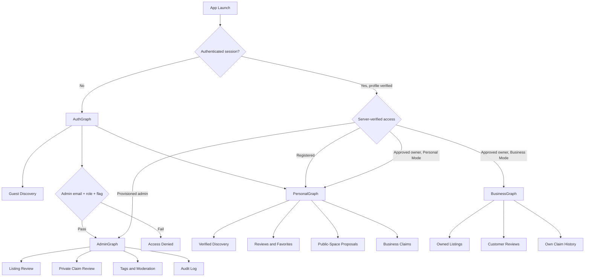

# Kapwa DVO - Refined Text Wireframe

## 1. Product-Wide Interaction and Security Rules

These rules apply to every navigation graph and screen.

### 1.1 Identity and role model

| User state | Server identity | Accessible experiences |
|---|---|---|
| Guest | Unauthenticated; not stored as a role | Verified discovery content and cached public listing data |
| Registered | `role = registered`, `is_admin = false` | Personal discovery, reviews, favorites, proposals, and claims |
| Business Owner | `role = business_owner`, `owner_verification_status = approved` | Registered-user features plus Business Mode for owned listings |
| Admin | `role = admin`, `is_admin = true`, manually provisioned | Administrative review, moderation, tagging, private evidence review, and audit history |

- Authentication alone never grants Business or Admin access.
- Role and ownership data always come from the server profile; cached mode preferences cannot grant access.
- Every protected destination uses a navigation guard. Unauthorized deep links route to `SignInScreen`, `AccessDeniedScreen`, or the appropriate safe graph.
- UI visibility is a usability measure only. All data and media operations remain subject to RLS, restricted database functions, and Storage policies.
- The client never offers controls for changing `role`, `is_admin`, `owner_verification_status`, `owner_id`, `submitted_by`, or moderation fields.
- If a protected operation returns an authorization error, the screen refreshes the server profile and exits the unauthorized destination.

### 1.2 Mode rules

- `AppMode` is a presentation preference, not a role.
- **Personal Mode** is available to registered users, approved business owners, and admins where applicable.
- **Business Mode** appears only when the current server profile is an approved `business_owner`.
- Business Mode controls disappear immediately if refreshed server data no longer confirms owner access.
- An owner can edit only listings whose server-provided `owner_id` matches the authenticated user.
- Admin capabilities are never exposed through the Business Mode switch.

### 1.3 Connectivity behavior

`OfflineBanner` is displayed persistently beneath the top app bar whenever connectivity is unavailable:

> You're offline. Showing saved data from [last refresh]. Online actions are unavailable.

- Cached verified listing records, coordinates, saved status, search, filters, and cached text details remain accessible.
- Cached images are best effort; missing images use a neutral placeholder.
- The app does not imply that Google base-map tiles are available offline.
- When map tiles are unavailable, the experience switches to a cached list with address and coordinate data.
- Current GPS location remains available when location services and permission are available.
- Reviews, proposals, community requests, claims, uploads, edits, routing, authentication, profile mutations, and administrative actions are disabled offline.
- The MVP never queues offline writes. Disabled actions explain that the user must reconnect and try again.
- Draft form contents may remain in current screen state, but the UI must not label them as submitted, uploaded, or scheduled to sync.

### 1.4 Shared write states

| State | UI behavior |
|---|---|
| Ready | Primary action is enabled after local validation passes |
| Submitting | Inputs and navigation action are locked; button shows progress |
| Success | Server-confirmed result is shown before navigation |
| Validation error | Relevant field shows an inline error and accessible error text |
| Conflict | Existing server record is shown, such as an existing review or pending claim |
| Authorization denied | Protected screen closes or becomes read-only after profile refresh |
| Connectivity lost | Submission stops; entered data remains visible for manual retry |
| Server failure | Error banner appears with `Try Again`; no optimistic success state |

### 1.5 Sensitive-data rules

- Claim evidence and owner-verification documents are never shown as public URLs.
- Documents are accessed only by the claimant for their own claim and by admins through short-lived signed URLs.
- Signed URLs, evidence paths, passwords, access tokens, and precise user locations never appear in logs or general UI.
- Private documents and admin notes are never written to Room.
- The claimant UI shows a safe filename, document type, upload status, and submission date - never an internal Storage path.
- Screenshots cannot be fully prevented, but sensitive evidence viewers should use Android secure-window protection where practical.
- Administrative actions display human-readable identities where available; raw IDs are relegated to a collapsed diagnostic section when genuinely necessary.

---

# 2. Launch, Authentication, and Access Recovery

## 2.1 App Launch and Session Resolution

### `AppLaunchScreen`

**Purpose:** Resolves session, connectivity, cached content, server profile, and permitted navigation before exposing role-gated screens.

**Main content:**

- Kapwa DVO logo and loading indicator.
- Status text: "Preparing your Davao discovery experience."

**State and navigation:**

1. If no authenticated session exists, navigate to `SignInScreen`.
2. If a session exists and the device is online, retrieve the authoritative profile before selecting a graph.
3. If a valid session exists but the profile cannot be refreshed because the device is offline:
   - Allow cached Personal discovery in read-only mode.
   - Do not expose Business or Admin graphs based only on a saved mode preference.
   - Show "Reconnect to verify account access."
4. If the profile is missing or inconsistent, clear privileged mode state and route to `AccountAccessErrorScreen`.
5. If an approved owner had Business Mode selected, enter `BusinessGraph`; otherwise enter `PersonalGraph`.
6. An admin session enters `AdminGraph` only after all admin checks pass.

## 2.2 Sign In

### `SignInScreen`

**Purpose:** Authenticates registered users and approved business owners.

**Top app bar:**

- Title: "Kapwa DVO"
- Subtitle: "Davao City Discovery"
- Action: `Continue as Guest`

**Main content:**

- Branding and discovery tagline.
- Email field:
  - Label: "Email address"
  - Placeholder: `name@example.com`
  - Keyboard type: Email
- Password field:
  - Label: "Password"
  - Placeholder: "Enter your password"
  - Visibility toggle
- Primary button: `Sign In`
- Outlined OAuth button: `Continue with Google`
- Text button: `Create an account`
- Text button: `Administrator Login`

**Validation and states:**

- Email required: "Enter your email address."
- Malformed email: "Enter a valid email address."
- Password required: "Enter your password."
- Offline: `OfflineBanner`; email/password and Google sign-in buttons disabled.
- Authentication failure uses a generic message: "Email or password is incorrect."
- On success, retrieve the server profile before selecting Personal or Business navigation.
- A normal sign-in does not route to AdminGraph merely because the email uses the admin domain.

## 2.3 Sign Up

### `SignUpScreen`

**Purpose:** Creates a community account with the default `registered` role.

**Top app bar:**

- Back arrow
- Title: "Create Account"

**Fields:**

- Display name:
  - Placeholder: "How your name appears to the community"
  - Required; 2-80 characters
- Email:
  - Placeholder: `name@example.com`
  - Required; valid email format
- Password:
  - Placeholder: "Create a strong password"
  - Required; follow configured authentication policy
- Confirm password:
  - Placeholder: "Re-enter your password"
  - Required; must match
- Checkbox:
  - "I agree to the Terms and Privacy Notice"
- Primary button: `Create Account`

**Supporting text:**

> New accounts receive Personal access. Business access is granted only after an ownership claim is approved. Administrator accounts cannot be created here.

**Validation and states:**

- Button remains disabled until required fields are valid and consent is selected.
- Offline mode disables registration.
- Successful registration displays email-verification guidance if verification is enabled.
- The request never contains role, admin, or owner-verification values supplied by the client.

## 2.4 Administrator Login

### `AdminLoginScreen`

**Purpose:** Authenticates manually provisioned administrators through a distinct, hardened entry point.

**Top app bar:**

- Back arrow
- Title: "Admin Portal"

**Main content:**

- Warning card: "Restricted access. Authorized Kapwa DVO administrators only."
- Admin email:
  - Placeholder: `staff@kapwadvo.com`
  - Helper: "Use the exact lowercase @kapwadvo.com domain."
- Password:
  - Placeholder: "Enter administrator password"
  - Visibility toggle
- Primary button: `Authorize Admin Access`
- Provisioning notice:
  - "Administrator accounts are created manually. Public sign-up does not grant admin access."

**Strict validation:**

- Do not trim silently; leading or trailing spaces produce an error.
- Do not lowercase before validation.
- Require the exact case-sensitive domain `@kapwadvo.com`.
- Error for uppercase or wrong domain: "Use your provisioned address with the exact @kapwadvo.com domain."
- Requires active connectivity.

**Post-authentication gate:**

AdminGraph opens only when all conditions are true:

- Supabase authentication succeeded.
- Authenticated email passes the exact domain rule.
- Server profile has `role = admin`.
- Server profile has `is_admin = true`.

A matching email domain without the server flags shows:

> This account is not provisioned for administrator access.

The screen never contains an admin registration or promotion control.

## 2.5 Authentication Required

### `AuthenticationRequiredSheet`

**Purpose:** Intercepts protected community actions attempted by a guest.

**Triggered by:**

- Save listing
- Add or edit review
- Add review photo
- Support a proposed space
- Propose a space
- Submit a business claim

**Content:**

- Title: "Sign in to continue"
- Contextual explanation, such as "Create an account to save this place."
- Primary action: `Sign In`
- Secondary action: `Create Account`
- Tertiary action: `Continue Browsing`

After successful authentication, return to the originating public screen. Do not automatically execute a write without renewed confirmation.

## 2.6 Access Denied

### `AccessDeniedScreen`

**Purpose:** Handles unauthorized deep links and revoked roles safely.

**Content:**

- Title: "You don't have access to this area"
- Explanation based on destination:
  - "Business Mode requires approved business ownership."
  - "Administrator access requires a provisioned admin account."
  - "You can view only claims submitted by your account."
- Primary action: `Return to Explore` or `Return to Personal Mode`
- Secondary action when relevant: `View Claim Status`

No protected data is briefly rendered while authorization is resolving.

---

# 3. Guest and Personal Discovery Journey

## 3.1 Map and Discovery

### `MapDiscoveryScreen`

**Purpose:** Primary entry point for discovering verified places.

**Top area:**

- Search field:
  - Placeholder: "Search places, gems, parks..."
- Filter button
- Profile/avatar button; uses sign-in icon for guests
- Filter chips:
  - `All`
  - `Hidden Gems`
  - `Tourist Spots`
  - `Public Spaces`
  - `Businesses`

**Main content:**

- `OfflineBanner` when disconnected.
- Last-refresh text when cached data is being used.
- Google Map with markers for verified listings only.
- Marker visual variants:
  - Business
  - Public space
  - Tourist spot
  - Hidden gem overlay
- Selected-listing bottom card:
  - Cached image or placeholder
  - Name
  - Listing type
  - Address
  - Distance when device location is available
  - Rating when available online or cached by a supported extension
  - `View Details`

**Floating actions:**

- `My Location`
- Map/list view toggle

**Personal bottom navigation:**

- `Explore`
- `Saved`
- `Propose`
- `Profile`

For guests, selecting `Saved`, `Propose`, or protected profile activity opens `AuthenticationRequiredSheet`.

**States:**

- Cached listing records render immediately, followed by online refresh.
- Pull-to-refresh is enabled online.
- Search and filters continue over cached fields offline.
- Location permission is requested only after the user invokes a location feature.
- Permission denied: show a non-blocking card with `Open Settings`; map browsing remains available.
- Base map unavailable offline: switch to list presentation rather than showing an unusable blank map.
- Route polylines appear only after a successful online route response.
- Pending, rejected, and hidden listings are never shown publicly.

## 3.2 Filters and List Exploration

### `ListingListScreen`

**Purpose:** Provides an accessible list alternative and a reliable offline fallback.

**Top app bar:**

- Back arrow
- Search query field
- Clear button
- Filter action

**Filter sheet:**

- Type:
  - `All types`
  - `Business`
  - `Public space`
  - `Tourist spot`
- Discovery tags:
  - `Hidden gem`
  - `Tourist spot`
- Sort:
  - `Nearest`
  - `Name A-Z`
  - `Highest rated` when rating data is available
- Distance radius:
  - `Any distance`
  - `Within 1 km`
  - `Within 5 km`
  - `Within 10 km`
- Actions: `Reset`, `Apply Filters`

**Listing card:**

- Photo or placeholder
- Name
- Address
- Type and admin-assigned discovery badges
- Rating summary when available
- Distance when location exists
- Saved indicator for authenticated users

**States:**

- Offline search operates only over cached fields.
- Explain unavailable sort criteria rather than returning misleading empty results.
- Empty state distinguishes:
  - No matching cached places
  - No cached places yet
  - Location unavailable
- Admin badges are display-only. No tagging controls exist in this graph.

## 3.3 Listing Details

### `ListingDetailScreen`

**Purpose:** Presents a verified listing and its allowed actions.

**Top app bar:**

- Back arrow
- Listing name
- Bookmark action:
  - Visible as an interactive action for authenticated users
  - Opens authentication prompt for guests
- Share action

**Main content:**

- Primary photo/gallery with placeholders for unavailable images.
- Badges:
  - Listing type
  - `Hidden Gem` only when server-assigned
  - `Tourist Spot` only when server-assigned
  - `Verified`
- Address
- Description
- Optional current distance
- Quick actions:
  - `Get Directions`
  - `Add Review` or `Edit Your Review`
  - `Claim This Business` when eligible
- Public-space proposal interest section where applicable.
- Reviews and aggregate rating.

**Claim visibility:**

`Claim This Business` appears only when:

- Listing type is `business`.
- Listing is verified and has no assigned owner.
- User is not a guest.
- User has no active pending claim for this listing.

Guests may see a contextual sign-in path, but no private claim data.

**Community-support visibility:**

`Support This Space` appears only for an authenticated user viewing a proposal they are authorized to inspect before verification. Public users cannot see arbitrary pending proposals. The architecture must implement a specific RLS policy or curated queue for this flow; otherwise, community support is restricted to directly shared or otherwise authorized proposals.

**Offline state:**

- Show cached name, type, description, address, coordinates, tags, and saved state.
- Do not promise cached reviews, because reviews are not part of the defined Room MVP cache.
- Review section displays: "Reviews require a connection."
- `Get Directions`, review actions, claim actions, community support, and remote bookmark mutations are disabled.
- If the chosen favorite design supports local bookmark changes, label them local-only until online reconciliation is implemented. For the strict MVP, disable bookmark writes offline to honor the no-offline-writes rule.

**Ownership banner:**

For the approved owner of this listing:

> You manage this listing.

Action: `Switch to Business Mode`

This banner and action require a current server-verified owner profile and matching `owner_id`.

## 3.4 Route Preview

### `RouteScreen`

**Purpose:** Displays a recommended point-to-point route, not turn-by-turn navigation.

**Top app bar:**

- Back arrow
- Title: "Route to [Place Name]"

**Main content:**

- Route summary:
  - Estimated travel time
  - Total distance
  - Destination address
- Map:
  - Current-location marker
  - Destination marker
  - Route polyline
- `Recenter` floating action

**Preconditions and errors:**

- Requires active internet.
- Requires current-location permission and a usable current location.
- Permission denied:
  - Explain why location is needed.
  - Provide `Open Settings`.
  - Keep destination address visible.
- Location unavailable:
  - "Your current location could not be determined."
  - `Try Again`
- No route returned:
  - "No recommended route is available."
  - `Return to Place`
- Connectivity lost:
  - Remove stale route-loading state.
  - Show destination details and `Return to Place`.
- Do not describe this as real-time turn-by-turn navigation.

---

# 4. Reviews and Favorites

## 4.1 Add or Edit Review

### `ReviewEditorScreen`

**Purpose:** Creates or updates the authenticated user's single review for a verified listing.

**Top app bar:**

- Back/cancel
- Title: `Write a Review` or `Edit Review`
- `Submit` or `Save`

**Fields:**

- Listing summary
- Rating:
  - Label: "Your rating"
  - Options: 1-5 stars
  - Required
- Review body:
  - Placeholder: "What should other visitors know about this place?"
  - Optional
  - Maximum 2,000 characters
- Photos:
  - `Add Photos`
  - Thumbnail, filename, remove action, and upload status
  - Public only after the review is successfully associated and visible

**Validation:**

- Missing rating: "Choose a rating from 1 to 5 stars."
- Body too long: "Review must be 2,000 characters or fewer."
- Unsupported file: "Choose a supported image file."
- Oversized file: show the configured upload limit.
- Existing review conflict: reload the existing review and change the screen to Edit mode.

**States:**

- Guests are redirected through `AuthenticationRequiredSheet`.
- Listing must still be verified at submission time.
- Offline: editor may display retained text, but submission and photo selection/upload are disabled with "Reconnect to submit or upload photos."
- Upload failure never creates a false completed state.
- User may delete their own review after confirmation.
- Owners cannot edit or delete other users' reviews.
- Hidden reviews are unavailable in public and owner views.

## 4.2 Saved Places

### `SavedPlacesScreen`

**Purpose:** Gives authenticated users fast access to their saved verified listings.

**Top app bar:**

- Title: "Saved Places"
- Optional search action

**Main content:**

- Saved listing cards from the Room-backed cache:
  - Cached photo or placeholder
  - Name
  - Type
  - Address
  - Admin-assigned tags
  - `Remove from Saved` action
- Empty state:
  - "No saved places yet."
  - `Explore Places`

**States:**

- Guest: authentication-required state, not an empty favorites list.
- Offline: saved records and cached details remain readable.
- To preserve the architecture's no-offline-write rule, adding or removing favorites is disabled offline:
  - "Reconnect to update saved places."
- If a listing is no longer verified after refresh, remove it from public saved results and explain that it is no longer available.
- No claim, admin, or business data is cached here.

## 4.3 My Reviews

### `MyReviewsScreen`

**Purpose:** Lists reviews created by the current user.

**Content:**

- Listing name
- Rating
- Review excerpt
- Last-updated date
- Status where relevant:
  - Visible
  - Hidden by moderation
- Actions:
  - `View Listing`
  - `Edit`
  - `Delete`

**States:**

- Online required for initial remote history unless a dedicated private cache is introduced.
- Offline state explains that review history is unavailable; it does not infer records from cached listings.
- A hidden review may be readable to its author only if a dedicated RLS rule permits that behavior. Otherwise, show only a moderation status supplied through an authorized endpoint.

---

# 5. Public-Space Proposal Journey

## 5.1 Proposal Form

### `ProposePublicSpaceScreen`

**Purpose:** Allows an authenticated user to propose a Davao public space or tourist attraction for administrative review.

**Top app bar:**

- Back arrow
- Title: "Propose a Place"
- No premature submit action in the app bar; use a clear final button after review.

**Information card:**

> Proposals remain private or limited to authorized community review until an administrator verifies them. Community interest can prioritize review but cannot publish a place automatically.

### Fields

| Field | Control and exact options | Validation |
|---|---|---|
| Place name | Text field; placeholder: "Example: Riverside Pocket Park" | Required; 2-120 characters |
| Proposed type | Dropdown: `Public space`, `Tourist spot` | Required; never offers `Business` |
| Address | Text field; placeholder: "Street, barangay, Davao City" | Required; nonblank |
| Location | Mini-map pin selector plus `Use Current Location` | Required valid latitude/longitude |
| Description | Multiline; placeholder: "Describe what visitors can do here, accessibility, landmarks, and why it should be included." | Required; architecture should define a practical maximum such as 2,000 characters |
| Primary photo | Image picker; helper: "Add a clear photo of the place." | Required by the documented runtime flow |
| Photo confirmation | Checkbox: "I have permission to share this photo." | Required |
| Accuracy confirmation | Checkbox: "The place and pin location are accurate to the best of my knowledge." | Required |

**Location picker states:**

- Permission not granted: manual map selection remains available.
- Location unavailable: allow manual pin placement.
- Coordinates displayed in a secondary confirmation row.
- Pin outside supported Davao boundary: "Choose a location within Davao City."
- If administrative boundary validation is not implemented, use a warning rather than claiming definitive boundary enforcement.

**Photo states:**

- Selected thumbnail and filename
- Replace and remove actions
- Unsupported format error
- Configured size-limit error
- Upload progress appears only after final submission begins

**Submission behavior:**

- Primary action: `Review Proposal`
- Review screen summarizes all public fields and location before final confirmation.
- Final action: `Submit for Review`
- Client request cannot set:
  - `owner_id`
  - `status`
  - `is_hidden_gem`
  - `is_tourist_spot`
  - another user's `submitted_by`
- Server-enforced result:
  - `submitted_by = auth.uid()`
  - `owner_id = null`
  - `status = pending`
  - administrative tags remain false until assigned by admin
- The proposed type may be `public_space` or `tourist_spot`; the tourist-spot discovery tag remains admin controlled.

**Offline and failure behavior:**

- Screen is available only to authenticated users.
- Offline banner remains visible.
- Inputs can be inspected, but photo upload and submission are disabled.
- No background upload or offline submission queue.
- If upload succeeds but record creation fails, the backend workflow should clean up the orphaned object or reuse it safely on retry.
- Duplicate-looking proposals may trigger a warning with nearby existing listings, but the user must not see nonpublic records they are unauthorized to read.

## 5.2 Proposal Review

### `ReviewProposalScreen`

**Purpose:** Prevents accidental submissions and misplaced pins.

**Content:**

- Name and proposed type
- Address
- Location map/pin
- Description
- Photo preview
- Privacy notice:
  - "Your display name may be associated with this submission for moderation."
- Actions:
  - `Edit Proposal`
  - `Submit for Review`

**States:**

- Revalidate connectivity and session before final submission.
- Submission success routes to `ProposalSubmittedScreen`.
- Server validation errors return to the relevant form field.

## 5.3 Proposal Confirmation

### `ProposalSubmittedScreen`

**Content:**

- Title: "Proposal submitted"
- Status: `Pending`
- Explanation:
  - "Community interest may help prioritize review."
  - "An administrator must verify the place before it becomes public."
- Actions:
  - `View My Proposals`
  - `Return to Explore`

Do not state that a proposal will automatically publish after reaching a vote threshold.

## 5.4 My Proposals

### `MyProposalsScreen`

**Purpose:** Lets users inspect only their own pending and resolved proposals.

**Tabs:**

- `Pending`
- `Verified`
- `Rejected`

**Proposal card:**

- Place name
- Proposed type
- Submission date
- Status
- Community-interest count when authorized
- Admin feedback when the data model supports safe submitter-visible feedback
- `View Details`

**States:**

- Own pending proposals are visible through RLS.
- Other users' pending proposals require an explicit architecture-approved community review policy.
- Offline: this private history is unavailable unless a separate secure cache is designed; do not place it in the general Room listing cache.

## 5.5 Community Proposal Support

### `CommunityProposalDetailScreen`

**Purpose:** Allows one authenticated request per user for a proposal that is eligible for community review.

**Important architectural prerequisite:**

The current representative RLS policies allow submitters, owners, and admins to read nonpublic listings, but do not grant other users access to pending proposals. This screen must not ship until the backend defines one of these safe options:

- A curated proposal-discovery view exposing only approved public fields.
- A distinct proposal table with explicit authenticated read policy.
- Admin-selected proposals promoted to a community-review status.

**Content when supported:**

- Public proposal fields only
- Approximate or exact location according to privacy policy
- Community-interest count
- `Support This Place`
- Supported state: "You supported this proposal."

**Rules:**

- One support record per authenticated user and proposal.
- Count is derived by a view or trigger; clients cannot write it directly.
- Offline support is disabled and never queued.
- Reaching the threshold adds priority; it does not verify or publish the listing.

---

# 6. Business Ownership Claim Journey

## 6.1 Claim Eligibility

### `ClaimEligibilityScreen`

**Purpose:** Confirms that the listing and user can begin a claim before collecting sensitive documents.

**Content:**

- Business name and address
- Eligibility checklist:
  - Listing is a verified business
  - Listing is not already assigned to another owner
  - Current user has no pending claim for this listing
- Privacy notice:
  - "Evidence is stored privately and can be viewed only by you and authorized administrators."
- Primary action: `Start Claim`

**States:**

- Guest: authentication prompt.
- Offline: action disabled.
- Already owned: "This business already has a verified owner."
- Pending claim exists: route to the existing claim.
- Server remains authoritative if eligibility changes after this screen.

## 6.2 Business Claim Form

### `SubmitBusinessClaimScreen`

**Purpose:** Collects enough business, claimant, relationship, and evidence information for manual ownership verification.

**Top app bar:**

- Back arrow
- Title: "Claim Business Ownership"

**Target-listing card:**

- Business name
- Address
- Listing photo
- Listing ID omitted from ordinary UI

### Claimant and relationship fields

| Field | Control and placeholder/options | Validation |
|---|---|---|
| Claimant name | Read-only server profile display name | Must match authenticated profile |
| Contact email | Read-only authenticated email, or editable contact field if separately modeled | Valid email |
| Contact phone | Text field; placeholder: "09XX XXX XXXX" | Required only if added to the claim schema |
| Relationship to business | Dropdown: `Owner`, `Co-owner`, `Authorized manager`, `Authorized representative` | Required |
| Registered business name | Text field; placeholder: "Name shown on permit or registration" | Required |
| Business registration or permit number | Text field; placeholder: "Permit or registration number" | Required if collected |
| Message to reviewer | Multiline; placeholder: "Explain your relationship to the business and any differences between the listing and your documents." | Optional; define a maximum length |

### Evidence fields

| Evidence | Control | Requirement |
|---|---|---|
| Government-issued ID | Private document picker | Required |
| Business permit or registration | Private document picker | Required |
| Proof of address or affiliation | Picker for utility bill, lease, authorization letter, or equivalent | Optional or conditionally required |
| Authorization letter | Private document picker | Required for `Authorized representative` |

**Document dropdown/type options:**

- `Government ID`
- `Business permit`
- `DTI/SEC/CDA registration`
- `Barangay clearance`
- `Lease agreement`
- `Utility bill`
- `Authorization letter`
- `Other ownership evidence`

**Each attachment card shows:**

- Safe local filename
- Selected document type
- File size
- Upload status
- Replace/remove actions
- Never the private Storage path or signed URL

**Consent controls:**

- Required checkbox: "I confirm that I am authorized to submit these documents."
- Required checkbox: "I understand that false claims may be rejected."
- Required privacy acknowledgement covering private evidence handling.

**Validation states:**

- Missing relationship: "Select your relationship to the business."
- Missing required document: "Add the required [document type]."
- Unsupported format: "Upload a supported image or PDF."
- File too large: display the configured maximum.
- Duplicate pending claim: route to the existing claim.
- Listing became owned: stop submission and explain the change.
- Session mismatch: clear selected sensitive files from UI state and require reauthentication.

**Architecture alignment requirement:**

The current `claims` table stores only one `evidence_path` and no structured contact, relationship, permit number, claimant message, or multiple-document metadata. To support the complete form, add:

- A `claim_documents` child table for multiple private evidence objects.
- Structured claim fields or a tightly controlled metadata record.
- Field-length constraints and RLS for claimant/admin access.

Until that schema exists, the MVP form must be limited to one consolidated evidence file plus fields actually persisted server-side. Do not collect sensitive data that the backend discards.

**Submission behavior:**

1. Revalidate listing eligibility.
2. Create a server-controlled claim identifier or secure upload context.
3. Upload documents beneath the authenticated claimant namespace.
4. Create the pending claim using `claimant_id = auth.uid()`.
5. Confirm success only after the claim and required evidence are linked.

**Offline behavior:**

- Entire flow is online-only.
- No offline evidence caching.
- No automatic retry after reconnection.
- Selected documents should be cleared when the session ends or the claim is successfully submitted.

## 6.3 Claim Review and Confirmation

### `ReviewBusinessClaimScreen`

**Content:**

- Target business
- Relationship
- Registered business name
- Masked permit/registration summary when collected
- Evidence checklist with filenames, not previews by default
- Privacy reminder
- Actions:
  - `Edit Claim`
  - `Submit Claim`

Final confirmation:

> Submit this claim for administrator review? You cannot submit another active claim for this business while this one is pending.

## 6.4 My Claims

### `MyClaimsScreen`

**Purpose:** Allows a registered user or business owner to view only their own claims.

**Claim card:**

- Business name
- Submission date
- Status:
  - `Pending`
  - `Approved`
  - `Rejected`
  - `Cancelled`
- Admin feedback when present
- `View Claim`

**Claim detail:**

- Claim summary
- Evidence list by safe filename and document type
- `View My Document` using a short-lived authorized URL
- Status timeline
- Admin notes intended for the claimant
- `Cancel Claim` only when status and backend policy permit cancellation

**Security and offline rules:**

- Claimant can read only claims where `claimant_id = auth.uid()`.
- Evidence access is reauthorized every time.
- Expired signed URL is replaced only after another authorization check.
- No private evidence or admin notes are cached in Room.
- Offline screen displays a privacy-safe unavailable state, not stale claim data.

---

# 7. Profile and Account

## 7.1 Personal Profile

### `PersonalProfileScreen`

**Purpose:** Manages safe profile fields and links to the user's activity.

**Content:**

- Avatar
- Display name
- Email, read-only
- Role-neutral wording such as "Community member"
- `Edit Profile`
- My Activity:
  - `My Reviews`
  - `My Proposals`
  - `My Claims`
- Settings:
  - Theme
  - Privacy notice
  - Clear cached public listing data
- `Sign Out`

**Business Mode card:**

Visible only when the current server profile confirms:

- `role = business_owner`
- `owner_verification_status = approved`

Content:

- Verified Business Owner badge
- Mode selector: `Personal` / `Business`
- Helper: "Changing mode changes the workspace, not your account permissions."

**Profile edit fields:**

- Display name, 2-80 characters
- Avatar
- No role, admin, verification, or ownership fields

**Offline behavior:**

- Cached profile summary may be displayed.
- Profile updates, avatar uploads, and server-dependent activity histories are disabled.
- Signing out clears session credentials and privileged mode state. Public listing cache may remain unless the user elects to clear it.
- Sensitive claim data is never retained.

---

# 8. Business Mode

## 8.1 Business Dashboard

### `BusinessDashboardScreen`

**Purpose:** Provides an approved owner with access to listings they own.

**Guard:**

- Current server profile is an approved `business_owner`.
- Every displayed listing has `owner_id = auth.uid()` or is returned by an owner-scoped server query.

**Top app bar:**

- Title: "Business Hub"
- `Switch to Personal`
- Settings action

**Main content:**

- Verified Business Owner badge
- Owned-listing cards:
  - Photo
  - Business name
  - Address
  - Public status
  - Review count and average rating
  - `Edit Listing`
  - `View Reviews`
  - `View Public Page`

**Business navigation:**

- `My Listings`
- `Customer Reviews`
- `Claims`
- `Personal Mode`

**States:**

- No owned listings: explain that ownership data may have changed and provide `View Claims`.
- Offline:
  - Show only public cached listing details that happen to correspond to owned listings.
  - Do not rely on cache to prove ownership.
  - Hide or disable management actions until owner access is reverified online.
- Authorization failure immediately returns to PersonalGraph.

## 8.2 Edit Owned Listing

### `EditOwnedListingScreen`

**Purpose:** Lets a verified owner edit safe fields of a listing they own.

**Editable fields:**

- Business name:
  - Placeholder: "Public business name"
  - 2-120 characters
- Address:
  - Placeholder: "Street, barangay, Davao City"
  - Required
- Description:
  - Placeholder: "Describe your business, services, and visitor information."
- Primary photo:
  - Replace/remove controls according to media policy

**Read-only fields:**

- Listing type
- Verification status
- Coordinates in the MVP
- Hidden Gem tag
- Tourist Spot tag
- Owner identity

**Never rendered as owner controls:**

- Status selector
- Hide listing
- Administrative tags
- Owner assignment
- Submitted-by identity

**States:**

- Save and upload are disabled offline.
- Before save, revalidate ownership server-side.
- Authorization failure discards no local text immediately; provide a copy-safe recovery message while returning to read-only view.
- Successful changes update the remote source, then refresh Room's public record.
- Owner updates must use column grants or a restricted RPC so moderation fields cannot be changed in a crafted request.

## 8.3 Customer Reviews

### `BusinessReviewsScreen`

**Purpose:** Gives owners a read-only view of visible feedback on their owned listings.

**Content:**

- Owned-listing dropdown
- Average rating
- Review count
- Rating distribution
- Visible review cards:
  - Reviewer display name
  - Rating
  - Date
  - Body
  - Public review photos

**Rules:**

- Owners cannot edit, hide, or delete customer reviews.
- Hidden reviews are excluded.
- No reviewer-private data is shown.
- Only reviews associated with an owned listing are available through BusinessGraph.
- Offline state does not claim reviews are cached unless a dedicated cache is added.

## 8.4 Business Claims

### `BusinessClaimTrackerScreen`

This is the same owner-scoped `MyClaimsScreen`, presented in Business navigation. It does not grant broader document access. An owner may view evidence only for claims they personally submitted unless they are also an authenticated admin using AdminGraph.

---

# 9. Administrator Journey

## 9.1 Admin Dashboard

### `AdminDashboardScreen`

**Purpose:** Summarizes privileged work queues.

**Guard:**

- Authenticated through the Admin entry flow.
- Exact admin email-domain rule passes.
- Server profile has `role = admin` and `is_admin = true`.
- RLS independently authorizes every query and mutation.

**Top app bar:**

- Title: "Admin Console"
- Provisioned admin identity
- `Sign Out`

**Queue cards:**

- Pending listing proposals
- Pending ownership claims
- Flagged or recent moderation items
- Audit history

**Admin navigation:**

- `Listings`
- `Claims`
- `Moderation`
- `Audit Log`

**States:**

- Entire graph requires connectivity.
- No administrative queue, private evidence, notes, or audit data is written to Room.
- When offline, display a blocking screen:
  - "Admin Console requires a secure network connection."
  - `Return to Sign In`
- If role verification fails, clear AdminGraph back stack and route to `AccessDeniedScreen`.

## 9.2 Listing Proposal Queue

### `AdminListingQueueScreen`

**Purpose:** Reviews pending proposals without automatically publishing them based on votes.

**Top controls:**

- Search
- Status filter:
  - `Pending`
  - `Verified`
  - `Rejected`
  - `Hidden`
- Proposed type:
  - `Public space`
  - `Tourist spot`
- Sort:
  - `Oldest first`
  - `Newest first`
  - `Highest community interest`

**Queue card:**

- Place name
- Proposed type
- Submitter display name
- Submission timestamp
- Address
- Coordinates
- Photo
- Community-interest count
- Priority indicator when the configured threshold is reached
- `Review`

Raw user IDs are not the primary visual identity.

## 9.3 Listing Proposal Review

### `AdminListingReviewScreen`

**Purpose:** Gives an admin a deliberate, auditable approval or rejection flow.

**Content:**

- Full proposal fields
- Map and coordinates
- Uploaded photo
- Submitter identity
- Community-interest count
- Similar verified listings where available
- Moderation notes field:
  - Placeholder: "Record the reason for this decision."
- Decision actions:
  - `Verify and Publish`
  - `Reject Proposal`

**Confirmation dialogs:**

- Verify:
  - "Publish this place to public discovery?"
  - `Cancel`, `Verify and Publish`
- Reject:
  - Rejection reason required
  - `Cancel`, `Reject Proposal`

**Rules:**

- Community threshold only affects queue priority.
- Admin decision is required for publication.
- Verification writes an audit event.
- Rejection writes an audit event.
- The submitter cannot modify status or tags through the client.
- All mutations are disabled offline.

## 9.4 Ownership Claims Queue

### `AdminClaimsQueueScreen`

**Purpose:** Reviews private business-ownership evidence.

**Top controls:**

- Status:
  - `Pending`
  - `Approved`
  - `Rejected`
  - `Cancelled`
- Sort:
  - `Oldest first`
  - `Newest first`
- Search by business or claimant display name

**Claim card:**

- Business name and address
- Claimant display name
- Relationship to business, if modeled
- Submission date
- Evidence count
- `Review Claim`

Private files are not loaded into queue thumbnails.

## 9.5 Claim Review and Evidence Viewer

### `AdminClaimReviewScreen`

**Purpose:** Supports a secure and auditable claim decision.

**Content:**

- Business listing summary
- Claimant profile summary
- Claim fields
- Evidence list by document type and safe filename
- `View Document` for each item
- Admin notes:
  - Placeholder: "Add decision notes or explain what evidence is missing."
- Actions:
  - `Approve Claim`
  - `Reject Claim`

### `PrivateEvidenceViewerScreen`

**Rules:**

- Opens only after a fresh authorization check.
- Uses a short-lived signed URL.
- Shows one document at a time.
- Displays an expiry/reload state without exposing the URL.
- No download/share action unless explicitly required and authorized.
- Uses secure-window protection where practical.
- Never writes the file to the general offline cache.
- Closing the viewer discards temporary access state.

### Approval confirmation

Display the effects before execution:

- Approve the claim
- Assign the listing owner
- Set approved owner-verification status
- Promote the claimant to `business_owner` when appropriate

Primary action: `Approve Ownership`

This must invoke one privileged transactional server operation. The UI must not perform the state changes as separate client writes.

### Rejection confirmation

- Rejection reason is required.
- Action: `Reject Claim`
- Does not assign ownership or promote role.
- Writes an audit event.

A claimant can never access this screen or decision controls, including through a crafted deep link.

## 9.6 Listing Tagging and Moderation

### `AdminModerationScreen`

**Purpose:** Houses controls that must never appear in Personal or Business graphs.

**Tabs:**

- `Listing Tags`
- `Listing Visibility`
- `Review Moderation`
- `Reports` when `moderation_reports` is implemented

### Listing Tags

For verified listings:

- `Hidden Gem` toggle
- `Tourist Spot` toggle
- Save confirmation

These are strictly admin-only controls. Public and owner screens display the resulting tags as read-only badges.

### Listing Visibility

- Current status
- `Hide Listing`
- `Restore Listing` to an allowed state
- Required moderation reason

### Review Moderation

- Review body
- Rating
- Author display identity
- Associated listing
- Moderation context or report
- Actions:
  - `Hide Review`
  - `Unhide Review` if supported
  - `Delete Review` only if permanent deletion is an explicit policy

Prefer hiding over destructive deletion for auditability. Every action requires confirmation and produces an audit entry.

**States:**

- Offline actions disabled.
- Optimistic toggles are avoided for sensitive moderation changes.
- Server-confirmed state replaces local state after each operation.
- A failed write returns the control to its authoritative value.

## 9.7 Audit Log

### `AdminAuditLogScreen`

**Purpose:** Presents an append-only record of sensitive administrative actions.

**Top controls:**

- Date range
- Administrator
- Action type
- Target type
- Clear filters

**Audit entry:**

- Timestamp with timezone
- Administrator display name and provisioned email
- Action:
  - Claim approved or rejected
  - Listing verified, rejected, hidden, or restored
  - Administrative tag assigned or removed
  - Review hidden, restored, or deleted
  - Role or owner assignment caused by an approved claim
- Target type and human-readable name
- Result
- Decision notes where safe
- Expandable technical identifiers for troubleshooting only

**Rules:**

- Read-only in the app.
- No edit or delete controls.
- Never displays access tokens, signed URLs, passwords, full private-document contents, or precise current user location.
- Admin-only RLS applies.
- Online-only; no audit cache.

---

# 10. Global Error and Empty States

## 10.1 No Cached Data

### `NoCachedDiscoveryScreen`

Shown when offline and Room has no verified listing records.

**Content:**

- "No places are available offline yet."
- "Connect once to download the latest verified places."
- Cached Saved list is offered only if records exist.

The screen does not suggest that map tiles or remote content are available.

## 10.2 Session Expired

### `SessionExpiredDialog`

- Title: "Session expired"
- Message: "Sign in again to continue with account actions."
- `Sign In`
- `Continue as Guest`

Sensitive form attachments are cleared before returning to authentication.

## 10.3 Server Authorization Changed

### `AccessChangedDialog`

- "Your account access has changed."
- Protected graph is removed from the back stack.
- Public or Personal discovery remains available when appropriate.

## 10.4 Destructive Confirmation

Used for review deletion, claim cancellation, listing hiding, rejection, and other consequential actions.

- Clearly names the target.
- Explains whether the operation is reversible.
- Uses specific actions such as `Hide Listing`, not a generic `Confirm`.

---

# 11. Navigation Summary

---

# 12. Required Architecture Adjustments Exposed by the Review

The refined flows reveal several backend details that should be resolved before implementation.

| Gap | Required decision |
|---|---|
| Community users cannot read pending proposals under the representative RLS policy | Add a safe community-review view/status or remove proposal discovery and support until defined |
| `claims.evidence_path` supports only one file | Add `claim_documents` for ID, permit, authorization letter, and other evidence |
| Detailed claim fields are not in the schema | Add constrained structured columns or reduce the form to data the backend actually stores |
| Proposal description has no maximum length | Add a database constraint and matching client counter |
| Claim/admin notes have no maximum length | Add practical database limits and client counters |
| Favorites offline mutation conflicts with the no-offline-write policy | Disable add/remove offline, or explicitly design a synchronization mechanism outside the strict MVP |
| Baseline claimed cached reviews | Keep reviews online-only unless a review cache is intentionally added |
| Claimant evidence access is described but Storage policy implementation must match it | Enforce claimant/admin object access using authenticated path namespaces and short-lived URLs |
| Audit log is recommended but not formally defined | Add an append-only table, admin-only read policy, and server-side writes from privileged workflows |
| Moderation reports appear only as a recommended table | Either implement report intake and resolution or limit MVP moderation to recent/admin-selected content |
| Owner listing updates could alter protected columns under broad updates | Use restricted column grants or a narrow owner-update RPC |
| Admin login validation alone is insufficient | Require exact email rule, server role and flag, RLS, manual provisioning, and audited privileged functions |

This wireframe keeps public exploration resilient offline while treating identity, ownership, private evidence, administrative tags, and moderation state as online, server-authorized capabilities.
