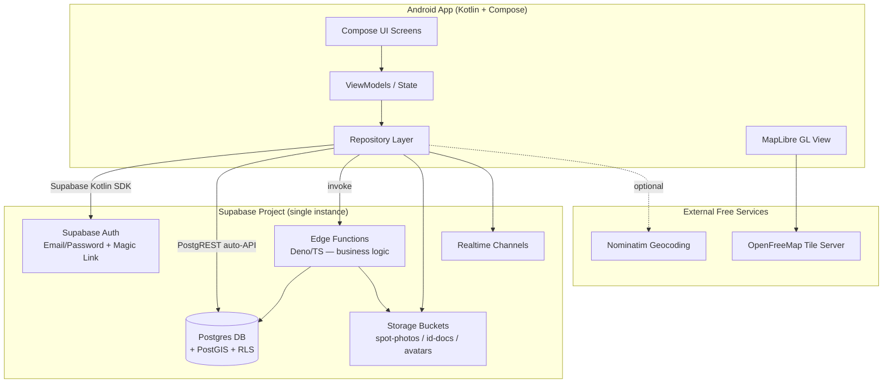

# Kapwa DVO — Technical Architecture & Execution Blueprint
### "Discover the hidden Davao" — $0-Budget Android App

**Prepared by:** Master Architect (Claude Sonnet 5)
**For:** Academic capstone project
**Stack:** Native Kotlin + Jetpack Compose · Supabase · MapLibre
**Brand:** Primary `#2D6A4F`, clean white palette

---

## 0. Architect's Risk Register (read this first)

Every item below is a hidden cost or failure point that has killed $0-budget student projects before. Design decisions in this document exist specifically to neutralize these:

| Risk | Why it matters | Mitigation baked into this design |
|---|---|---|
| **Google Maps requires a card on file** | Even the free $200/mo credit needs billing enabled; a bug or infinite loop in a map component can generate real charges | Use **MapLibre GL Native** + **OpenFreeMap** tiles — no API key, no card, no cap |
| **Phone/SMS OTP is never free** | Twilio/MessageBird charge per SMS from message #1 | Auth is **Email + Password / Magic Link** only. Phone number is a stored profile field, not a verification channel |
| **Supabase free project auto-pauses after 7 days of inactivity** | If nobody touches it during a slow academic week, it goes to sleep and your demo fails cold | Add a step in the roadmap (Section 6) to ping it before every milestone/demo; document this for your team |
| **Google Play Console has a one-time $25 fee** | Violates the strict $0 rule | Do **not** publish to Play Store. Distribute a signed release APK directly (sideload) for grading/demo |
| **Automated ID/KYC verification APIs cost money** | Jumio, Persona, etc. all charge per verification | Business Owner verification is **manual admin review** — owner uploads photos to private storage, an admin flips a status flag |
| **Supabase free tier caps** | 500MB DB, 1GB file storage, 2 free projects, 50k MAUs | More than sufficient for an academic prototype with seeded Davao data — flagged so you don't over-scope |

---

## 1. System Architecture & Tech Stack

### 1.1 Layer-by-layer stack

| Layer | Service (Free Tier) | Why | Cost ceiling |
|---|---|---|---|
| **Client** | Android Native — Kotlin + Jetpack Compose | Required by brief | $0 |
| **Auth** | Supabase Auth (Email/Password + Magic Link) | Included free with Supabase project, no SMS cost | $0 |
| **Database** | Supabase Postgres (500MB) | Relational, RLS built-in, PostGIS included | $0 |
| **File Storage** | Supabase Storage (1GB) | ID docs, business docs, spot photos, avatars — same project, same auth context | $0 |
| **Backend Logic** | Supabase Edge Functions (Deno/TypeScript, 500K invocations/mo) | Custom logic: commission math, booking capacity checks, application workflows | $0 |
| **Realtime** | Supabase Realtime | Live booking status / notification badges — replaces need for push infra | $0 |
| **Maps (rendering)** | MapLibre GL Native SDK (Android) | Open-source, no key required | $0 |
| **Maps (tiles)** | OpenFreeMap (primary) / MapTiler free tier (backup, needs free key, no card) | Unlimited free vector tiles | $0 |
| **Geocoding** (address → lat/lng, for spot submissions) | Nominatim (OpenStreetMap) | Free, fair-use rate limited | $0 |
| **Design** | Figma (free plan) | Team's chosen tool | $0 |
| **Source Control** | GitHub (free, private repo) | Version control + shared context for both AIs | $0 |
| **CI (optional)** | GitHub Actions (2,000 min/mo free) | Lint/build checks | $0 |
| **Push Notifications** | *Out of scope for MVP* — use Supabase Realtime in-app instead | Avoids adding Firebase as a second backend | $0 |

> **Single source of truth principle:** Everything lives in **one Supabase project**. We deliberately avoid splitting Auth/DB across Supabase and Firebase — that's the #1 cause of sync bugs in student projects with two AI agents writing code in parallel.

### 1.2 High-level architecture diagram



### 1.3 Client-side architecture pattern

- **Pattern:** MVVM + Repository, unidirectional data flow (Compose `State`/`StateFlow`)
- **Modules:** `core:network` (Supabase client + Edge Function calls), `core:model` (DTOs matching API contracts below), `feature:discover`, `feature:map`, `feature:auth`, `feature:booking`, `feature:reviews`, `feature:owner-dashboard`
- **Role gating:** A single `sealed class UserSession { Guest, VerifiedUser(profile), BusinessOwner(profile, businesses) }` drives navigation and feature visibility — this maps directly to the `role` enum in the schema below.

---

## 2. Data Modeling & Schema

Target: **Supabase Postgres**, `public` schema, with the **PostGIS** extension enabled (included free) for radius-based spot search.

```sql
-- ============================================================
-- EXTENSIONS
-- ============================================================
create extension if not exists postgis;
create extension if not exists "uuid-ossp";

-- ============================================================
-- ENUMS
-- ============================================================
create type user_role            as enum ('verified_user', 'business_owner', 'admin');
create type spot_category        as enum ('cafe', 'restaurant', 'hotel', 'nightlife', 'park', 'leisure', 'hidden_gem');
create type spot_source          as enum ('official', 'crowdsourced');
create type spot_status          as enum ('active', 'pending_review', 'rejected', 'unclaimed');
create type application_status   as enum ('pending', 'approved', 'rejected');
create type booking_status       as enum ('pending', 'confirmed', 'cancelled', 'completed', 'no_show');
create type ledger_status        as enum ('pending', 'released'); -- simulated payout state

-- ============================================================
-- PROFILES (extends auth.users, 1:1)
-- ============================================================
create table public.profiles (
    id                  uuid primary key references auth.users(id) on delete cascade,
    full_name           text not null,
    phone               text,                         -- informational only, NOT OTP-verified
    avatar_url          text,
    role                user_role not null default 'verified_user',
    saved_checkout      jsonb default '{}'::jsonb,     -- {name, phone, notes} for booking auto-fill
    is_business_owner   boolean not null default false,
    created_at          timestamptz not null default now(),
    updated_at          timestamptz not null default now()
);

-- ============================================================
-- BUSINESS OWNER APPLICATIONS (KYC — manually reviewed)
-- ============================================================
create table public.business_owner_applications (
    id                  uuid primary key default uuid_generate_v4(),
    user_id             uuid not null references public.profiles(id) on delete cascade,
    government_id_url   text not null,   -- private storage path
    business_doc_url    text not null,   -- private storage path (DTI/SEC/Mayor's permit etc.)
    status              application_status not null default 'pending',
    reviewer_id         uuid references public.profiles(id),
    reviewer_notes      text,
    submitted_at        timestamptz not null default now(),
    reviewed_at         timestamptz
);

-- ============================================================
-- SPOTS (universal POI table — hidden gems AND claimable businesses)
-- ============================================================
create table public.spots (
    id                  uuid primary key default uuid_generate_v4(),
    name                text not null,
    slug                text unique not null,
    description         text,
    category            spot_category not null,
    address             text,
    latitude            double precision not null,
    longitude           double precision not null,
    location            geography(Point, 4326)
                        generated always as (
                            ST_SetSRID(ST_MakePoint(longitude, latitude), 4326)::geography
                        ) stored,
    source              spot_source not null default 'crowdsourced',
    status              spot_status not null default 'pending_review',
    owner_id            uuid references public.profiles(id),      -- set once claimed by a business_owner
    submitted_by        uuid references public.profiles(id),      -- verified_user who requested it
    cover_photo_url     text,
    price_range         text,          -- e.g. '₱', '₱₱', '₱₱₱'
    avg_rating          numeric(2,1) default 0,   -- denormalized, updated by trigger
    review_count        integer default 0,        -- denormalized, updated by trigger
    is_bookable         boolean default false,
    created_at          timestamptz not null default now(),
    updated_at          timestamptz not null default now()
);
create index spots_location_idx on public.spots using gist (location);
create index spots_category_idx on public.spots (category);
create index spots_status_idx on public.spots (status);

create table public.spot_photos (
    id                  uuid primary key default uuid_generate_v4(),
    spot_id             uuid not null references public.spots(id) on delete cascade,
    url                 text not null,
    uploaded_by         uuid references public.profiles(id),
    created_at          timestamptz not null default now()
);

-- ============================================================
-- BUSINESSES (extends a claimed spot with owner-managed commercial data)
-- ============================================================
create table public.businesses (
    id                  uuid primary key default uuid_generate_v4(),
    spot_id             uuid not null unique references public.spots(id) on delete cascade,
    owner_id            uuid not null references public.profiles(id),
    legal_name          text not null,
    registration_no     text,              -- DTI/SEC/permit number, self-declared
    commission_rate     numeric(4,2) not null default 0.10,  -- 10% simulated commission
    is_active           boolean not null default true,
    created_at          timestamptz not null default now()
);

-- ============================================================
-- BOOKING SLOTS (owner-managed availability)
-- ============================================================
create table public.booking_slots (
    id                  uuid primary key default uuid_generate_v4(),
    business_id         uuid not null references public.businesses(id) on delete cascade,
    slot_date           date not null,
    start_time          time not null,
    end_time            time not null,
    capacity            integer not null default 1,
    booked_count        integer not null default 0,
    price               numeric(10,2) not null,
    is_active           boolean not null default true,
    created_at          timestamptz not null default now(),
    check (booked_count <= capacity)
);
create index booking_slots_business_date_idx on public.booking_slots (business_id, slot_date);

-- ============================================================
-- BOOKINGS
-- ============================================================
create table public.bookings (
    id                  uuid primary key default uuid_generate_v4(),
    user_id             uuid not null references public.profiles(id),
    spot_id             uuid not null references public.spots(id),
    booking_slot_id     uuid references public.booking_slots(id),
    status              booking_status not null default 'pending',
    guest_count         integer not null default 1,
    total_amount        numeric(10,2) not null,
    commission_amount   numeric(10,2) not null,
    checkout_details    jsonb not null,   -- snapshot of {name, phone, notes} at time of booking
    created_at          timestamptz not null default now(),
    updated_at          timestamptz not null default now()
);
create index bookings_user_idx on public.bookings (user_id);
create index bookings_spot_idx on public.bookings (spot_id);

-- ============================================================
-- REVIEWS
-- ============================================================
create table public.reviews (
    id                  uuid primary key default uuid_generate_v4(),
    user_id             uuid not null references public.profiles(id),
    spot_id             uuid not null references public.spots(id),
    booking_id          uuid references public.bookings(id),  -- null = general review, set = verified stay/visit
    rating              smallint not null check (rating between 1 and 5),
    comment             text,
    photo_urls          text[] default '{}',
    created_at          timestamptz not null default now(),
    updated_at          timestamptz not null default now(),
    unique (user_id, spot_id, booking_id)
);

-- ============================================================
-- EARNINGS LEDGER (simulated payouts for Business Owner dashboard)
-- ============================================================
create table public.earnings_ledger (
    id                  uuid primary key default uuid_generate_v4(),
    business_id         uuid not null references public.businesses(id),
    booking_id          uuid not null references public.bookings(id),
    gross_amount        numeric(10,2) not null,
    commission_amount   numeric(10,2) not null,
    net_amount          numeric(10,2) not null,
    status              ledger_status not null default 'pending',
    created_at          timestamptz not null default now()
);
```

### 2.1 Schema notes for the Backend AI

- **RLS is mandatory on every table.** Baseline policy pattern: `profiles` — user can read/update own row, admins read all; `spots` — public read where `status = 'active'`, owners/admins full access to their own; `bookings`/`reviews` — user can CRUD only their own rows; `business_owner_applications` — user reads own, admin reads/updates all. Full policy SQL is Gemini's job in Prompt B (Section 4.2) — this document defines the *shape*, not every policy line, to keep the schema portable.
- **Triggers needed:** (1) after insert/update/delete on `reviews` → recompute `spots.avg_rating` and `spots.review_count`; (2) after insert on `bookings` with status `confirmed` → increment `booking_slots.booked_count` and insert into `earnings_ledger`.
- **Spot lifecycle:** `pending_review` (verified_user submitted) → `active` (admin approved) or `rejected`. A `crowdsourced` + `active` spot with `owner_id = null` is `unclaimed` and shows a "Claim this business" CTA to business owners.

---

## 3. API Contracts

Two access patterns:
1. **PostgREST auto-generated REST** (via Supabase client SDK) for simple CRUD reads — used directly by the frontend for `GET` operations that RLS already protects.
2. **Edge Functions** for anything with business logic — used for writes that must validate, compute, or touch multiple tables atomically.

All endpoints below are Edge Functions unless marked `(PostgREST)`. Base path: `https://<project>.supabase.co/functions/v1/`. Auth: Bearer JWT from Supabase Auth session, except where marked `Public`.

| Method | Endpoint | Auth | Purpose |
|---|---|---|---|
| GET | `/spots` *(PostgREST + RPC for radius)* | Public | Search/filter spots — see 3.1 |
| GET | `/spots/:id` *(PostgREST)* | Public | Spot detail incl. photos, avg rating |
| POST | `/spots` | Verified User | Submit an unlisted spot for review — see 3.2 |
| POST | `/spots/:id/claim` | Business Owner (approved) | Claim a crowdsourced/unclaimed spot |
| POST | `/business-applications` | Verified User | Submit gov ID + business doc — see 3.3 |
| GET | `/business-applications/me` | Verified User | Check own application status |
| PATCH | `/business-applications/:id` | Admin | Approve/reject application |
| POST | `/businesses/:id/booking-slots` | Business Owner (own business) | Create availability slots |
| GET | `/businesses/:id/booking-slots` *(PostgREST)* | Public | List open slots for a business |
| POST | `/bookings` | Verified User | Create a booking — see 3.4 |
| GET | `/bookings/me` *(PostgREST)* | Verified User | User's own booking history |
| PATCH | `/bookings/:id/status` | Business Owner (own business) | Confirm / cancel / mark completed |
| POST | `/reviews` | Verified User | Submit a review — see 3.5 |
| GET | `/spots/:id/reviews` *(PostgREST)* | Public | List reviews for a spot |
| GET | `/businesses/:id/earnings` | Business Owner (own business) | Aggregated earnings dashboard |
| GET | `/profiles/me` *(PostgREST)* | Verified User | Own profile incl. saved checkout info |
| PATCH | `/profiles/me` *(PostgREST)* | Verified User | Update profile / saved checkout autofill |

### 3.1 `GET /spots` — Search & filter

**Query params:** `category`, `lat`, `lng`, `radius_km`, `search`, `min_rating`, `price_range`, `page`, `limit`

```json
// Response 200
{
  "data": [
    {
      "id": "uuid",
      "name": "Matina Town Square",
      "category": "leisure",
      "latitude": 7.0644,
      "longitude": 125.6127,
      "distance_km": 1.8,
      "cover_photo_url": "https://.../cover.jpg",
      "avg_rating": 4.6,
      "review_count": 128,
      "price_range": "₱₱",
      "is_bookable": true,
      "status": "active"
    }
  ],
  "page": 1,
  "limit": 20,
  "total": 143
}
```

### 3.2 `POST /spots` — Request an unlisted spot (Verified User)

```json
// Request
{
  "name": "Hidden Falls, Baguio District",
  "category": "hidden_gem",
  "description": "Small waterfall, 15-min hike from the road, locals call it...",
  "address": "Baguio District, Davao City",
  "latitude": 7.1234,
  "longitude": 125.4567
}

// Response 201
{ "id": "uuid", "status": "pending_review", "message": "Submitted for admin review." }
```

### 3.3 `POST /business-applications` (Verified User → Business Owner)

```json
// Request (multipart or pre-uploaded storage paths)
{
  "government_id_url": "id-docs/uuid/gov-id.jpg",
  "business_doc_url": "id-docs/uuid/dti-permit.jpg"
}

// Response 201
{ "id": "uuid", "status": "pending", "submitted_at": "2026-09-09T10:00:00Z" }
```

### 3.4 `POST /bookings`

```json
// Request
{
  "spot_id": "uuid",
  "booking_slot_id": "uuid",
  "guest_count": 2,
  "checkout_details": { "name": "Juan Dela Cruz", "phone": "0917xxxxxxx", "notes": "Window seat please" }
}

// Response 201
{
  "id": "uuid",
  "status": "pending",
  "total_amount": 1200.00,
  "commission_amount": 120.00
}

// Error 409 — slot full
{ "error": "SLOT_FULL", "message": "This slot has no remaining capacity." }
```

### 3.5 `POST /reviews`

```json
// Request
{ "spot_id": "uuid", "booking_id": "uuid", "rating": 5, "comment": "Great coffee, hidden but worth it!", "photo_urls": [] }

// Response 201
{ "id": "uuid", "created_at": "2026-09-09T10:00:00Z" }
```

### 3.6 Standard error shape (all endpoints)

```json
{ "error": "ERROR_CODE", "message": "Human-readable explanation" }
```

Common codes: `UNAUTHENTICATED`, `FORBIDDEN_ROLE`, `VALIDATION_ERROR`, `NOT_FOUND`, `SLOT_FULL`, `ALREADY_CLAIMED`, `APPLICATION_ALREADY_PENDING`.

---

## 4. AI Developer Prompts

Copy each block verbatim into the respective tool. Feed **Prompt B first** — the frontend AI needs a live schema/API to build against.

### 4.1 Prompt A — Frontend (Sonnet 5 via Google Antigravity)

```
You are building the Android frontend for "Kapwa DVO" — Discover the hidden Davao — a
Davao City hotels/restaurants/spots discovery and booking app.

CONTEXT
- Stack: Native Android, Kotlin, Jetpack Compose, Material 3.
- Architecture: MVVM + Repository pattern, unidirectional state (StateFlow).
- Backend: Supabase (Auth, Postgres via PostgREST, Storage, Edge Functions, Realtime).
  Use the official Supabase Kotlin SDK (supabase-kt) — modules: Auth, Postgrest, Storage,
  Realtime, Functions.
- Maps: MapLibre GL Native Android SDK rendering OpenFreeMap vector tiles (no API key
  required). Do NOT use Google Maps SDK anywhere in this project.
- Brand: primary color #2D6A4F, clean white background palette, generous whitespace,
  rounded cards, warm/local Davao character in imagery and copy — avoid generic
  stock-app aesthetics.

INPUTS YOU WILL RECEIVE
1. A Figma prototype link/export (screens for Guest, Verified User, and Business Owner
   flows). Treat it as the UX foundation, not a pixel-locked spec — you are authorized
   to improve spacing, hierarchy, empty states, loading states, and error states where
   the Figma is incomplete, as long as you preserve the brand palette and information
   architecture.
2. The API Contracts and Data Schema from "Kapwa DVO — Technical Architecture &
   Execution Blueprint" (attached separately) — treat every field name, type, and
   endpoint shape in that document as the binding contract. Do not invent field names.

USER ROLES TO IMPLEMENT (single app, role-gated navigation)
- Guest: browse/search/filter spots by category (Cafes, Restaurants, Hotels, Nightlife,
  Parks, Leisure), interactive map view, spot detail view. No auth required.
- Verified User: Guest features + email/password or magic-link auth, leave
  ratings/reviews, book listings with slot selection, saved checkout auto-fill
  (name/phone/notes persisted to profile), request an unlisted spot, apply to become a
  Business Owner (upload gov ID + business doc to Supabase Storage private bucket).
- Business Owner (post-approval): list/claim businesses, manage booking slots
  (create/edit/deactivate), view and update bookings (confirm/cancel/complete), view an
  earnings dashboard (gross/commission/net, simulated — no real payment gateway).

DELIVERABLES
1. Project module structure: core:model, core:network (Supabase client wrapper +
   Edge Function callers matching the API Contracts exactly), core:ui (design system:
   colors, typography, spacing tokens derived from #2D6A4F + white), and one
   feature module per flow (auth, discover, map, spot-detail, booking, reviews,
   owner-dashboard, profile).
2. A sealed UserSession state (Guest / VerifiedUser / BusinessOwner) driving a single
   NavHost with role-conditional destinations and a bottom nav bar that adapts by role.
3. Every network call must map 1:1 to an endpoint in the API Contracts section —
   request/response DTOs as Kotlin data classes with @Serializable, matching field
   names exactly (snake_case in JSON via @SerialName, camelCase in Kotlin).
4. Handle all documented error codes (UNAUTHENTICATED, FORBIDDEN_ROLE,
   VALIDATION_ERROR, NOT_FOUND, SLOT_FULL, ALREADY_CLAIMED,
   APPLICATION_ALREADY_PENDING) with user-facing messaging, not raw error dumps.
5. MapLibre integration: category-colored markers, clustering for dense areas,
   "search this area" behavior, radius-filtered results synced with the list view.
6. Loading, empty, and error states for every screen — do not leave any screen
   without these three states designed.
7. Do not implement push notifications — use Supabase Realtime channel subscriptions
   for booking status updates instead.

CONSTRAINTS
- $0 budget: no paid SDKs, no Google Maps, no Firebase, no third-party analytics.
- Do not hardcode Supabase keys — read from local.properties / BuildConfig.
- Assume the backend (Edge Functions + RLS) is being built in parallel against the
  same contract — mock the network layer behind an interface so UI work isn't blocked.

Begin by proposing the module/package structure and the UserSession + navigation graph
design, then proceed screen-by-screen starting with Guest discovery + map.
```

### 4.2 Prompt B — Backend (Gemini 3.1 Pro via Google Antigravity)

```
You are building the backend for "Kapwa DVO" — Discover the hidden Davao — entirely
on Supabase's free tier. Zero budget: every choice must stay inside Supabase's free
tier limits (500MB DB, 1GB storage, 500K Edge Function invocations/month, 50K MAUs).

DELIVERABLES

1. DATABASE SETUP
   Execute the exact SQL schema provided in "Kapwa DVO — Technical Architecture &
   Execution Blueprint" Section 2 verbatim (enums, tables, indexes, generated
   PostGIS location column). Do not rename fields or tables — the frontend AI is
   coding against these exact names in parallel.

2. ROW LEVEL SECURITY
   Enable RLS on every table and implement policies matching this access model:
   - profiles: user selects/updates own row only; admins select all.
   - spots: public SELECT where status = 'active'; submitter can SELECT their own
     pending_review rows; owner_id holder has full access to their claimed spot;
     admins have full access.
   - spot_photos: public SELECT for photos on active spots; INSERT restricted to
     the spot's owner or an admin.
   - businesses / booking_slots: public SELECT where is_active = true; INSERT/UPDATE
     restricted to the business's owner_id or admin.
   - bookings: user can SELECT/INSERT their own rows; business owner can SELECT/UPDATE
     bookings tied to their own business; admins full access.
   - reviews: public SELECT; INSERT restricted to authenticated users for their own
     user_id, only once per (user_id, spot_id, booking_id).
   - business_owner_applications: user SELECT/INSERT own row; admin SELECT/UPDATE all.
   - earnings_ledger: business owner SELECT rows tied to their own business_id only.

3. DATABASE TRIGGERS
   - After INSERT/UPDATE/DELETE on reviews: recompute the parent spot's avg_rating
     and review_count.
   - After a booking's status transitions to 'confirmed': increment the linked
     booking_slot's booked_count (reject if it would exceed capacity — raise an
     exception the Edge Function can catch as SLOT_FULL) and insert a corresponding
     row into earnings_ledger using the business's commission_rate.

4. EDGE FUNCTIONS (Deno/TypeScript)
   Implement every non-PostgREST endpoint listed in the API Contracts (Section 3 of
   the blueprint) as an individual Edge Function, matching request/response JSON
   shapes exactly, including the standard error shape:
     { "error": "ERROR_CODE", "message": "..." }
   Required functions: spots (POST, and the radius-search RPC used by GET /spots),
   spots/:id/claim, business-applications (POST + PATCH for admin approval),
   businesses/:id/booking-slots (POST), bookings (POST), bookings/:id/status (PATCH),
   reviews (POST), businesses/:id/earnings (GET aggregate).
   Every function must: verify the caller's JWT, verify the caller's role/ownership
   before mutating, validate input, and return the documented error codes on failure.

5. STORAGE BUCKETS
   Create buckets: spot-photos (public read), avatars (public read), id-docs (private —
   readable only by the uploading user and admins), business-docs (private — same
   policy as id-docs). Write the storage RLS policies for each.

6. SEED DATA
   Generate a realistic seed script (SQL or Edge Function) with ~25-30 real or
   plausible Davao City spots spread across all six categories (cafes, restaurants,
   hotels, nightlife, parks, leisure), with approximate real coordinates within Davao
   City bounds (roughly 7.00–7.20°N, 125.55–125.70°E), so the frontend team has data
   to develop and demo against immediately.

7. ADMIN PATH
   Since ID/business-document verification is manual for this academic build, expose
   a simple way for an admin (a profiles row with role = 'admin') to list pending
   business_owner_applications and spots (status = 'pending_review') and
   approve/reject them — either via a minimal Edge Function pair or documented direct
   Supabase Studio table access. No need to build a separate admin app.

CONSTRAINTS
- No paid Supabase add-ons (no compute upgrades, no custom domains).
- No external paid APIs. Geocoding, if needed server-side, must use Nominatim
  (OpenStreetMap) with a cached/rate-limited approach.
- Document every environment variable / secret the Edge Functions require.

Begin by confirming the schema executes cleanly, then implement RLS, then triggers,
then Edge Functions in the order listed above.
```

---

## 5. Execution Roadmap (Human Operator Steps)

You are the orchestrator between Figma, two AI code-gens, and Supabase. Follow this order — it's designed so each AI always has what it needs when you hand it the baton.

| # | Step | Owner | Output |
|---|---|---|---|
| 1 | Create the Supabase project (free tier). Save the project URL + anon key. Enable the PostGIS extension in Database → Extensions. | You | Live Supabase project |
| 2 | Create a private GitHub repo. Add this document (`kapwa-dvo-architecture.md`) to the repo root — both AIs and you will reference it throughout. | You | Repo + shared context doc |
| 3 | Build wireframes/prototype in Figma for the three role flows (Guest, Verified User, Business Owner), using `#2D6A4F` + white as the palette. Doesn't need to be pixel-perfect — Prompt A explicitly allows the frontend AI to refine it. | You (+Figma) | Figma prototype link |
| 4 | Feed **Prompt B** (Section 4.2) to Gemini 3.1 Pro in Google Antigravity, with this document attached for the exact schema/contracts. Let it execute the SQL, RLS, triggers, Edge Functions, and seed data against your live Supabase project. | Gemini 3.1 Pro | Live DB + RLS + Edge Functions + seed data |
| 5 | Verify the backend independently before touching frontend: run each Edge Function via Supabase's dashboard function tester or `curl`/Postman against the contracts in Section 3. Fix mismatches now — it's far cheaper than debugging through two AI layers later. | You | Verified working API |
| 6 | Feed **Prompt A** (Section 4.1) to Sonnet 5 in Google Antigravity, attaching this document + the Figma link + the confirmed-working Supabase URL/anon key. | Sonnet 5 | Kotlin/Compose app scaffold + screens |
| 7 | Wire the generated app to your real Supabase project (`local.properties`), run on an emulator, and walk all three role flows end-to-end: sign up → browse → book → review; submit unlisted spot → admin approves; apply as owner → admin approves → claim spot → create slots → receive booking → view earnings. | You | Working end-to-end demo |
| 8 | Fix integration gaps by routing specific error messages/screenshots back to the relevant AI (backend bug → Gemini, UI/state bug → Sonnet) rather than re-running the full prompt each time. | You | Stabilized build |
| 9 | **Two days before your presentation:** log into the Supabase dashboard to reset the 7-day inactivity clock, re-verify seed data is intact, and do a full dry run on a physical device. | You | Demo-ready state |
| 10 | Build a signed release APK in Android Studio (Build → Generate Signed App Bundle/APK). Do **not** submit to Google Play Console (avoids the $25 fee). Distribute the APK directly (drive link/USB) for grading, or present live from a device. | You | Deliverable APK |
| 11 | Prepare the "simulated monetization" talking point for your presentation: show the `earnings_ledger` entries as evidence the commission model works end-to-end, and be upfront that it's simulated (no real payment gateway) as a scoping decision, not a gap. | You | Presentation narrative |

### Ongoing rule for the whole build
Whenever either AI proposes a field name, endpoint shape, or table that isn't in Section 2 or 3 of this document, treat that as a signal to update **this document first**, then re-sync both AIs — never let the two codebases drift from independently "helpful" additions. This document is the contract; the AIs are implementers of it, not co-designers of it.
